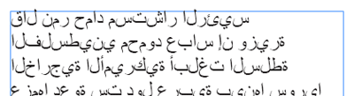
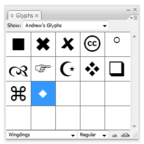
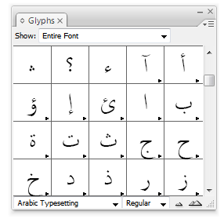
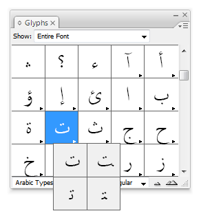
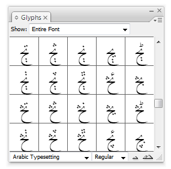

About a year ago I discovered to my dismay that using Arabic in InDesign was entirely impossible. <!--more--> I wanted to make a type of dictionary for my Arabic 101 students, using an Excel spreadsheet full of Arabic words. When I placed any Arabic text, though, this happened:

While Microsoft and Apple have great right-to-left (RTL) language support built in, Adobe doesn't. InDesign and Illustrator *cannot* handle RTL text. Adobe has, however, outsourced their code to [WinSoft](http://www.winsoft.eu/), who develops the Creative Suite ME (Middle Eastern edition), which *does* have excellent RTL support, especially through the use of their [Tasmeem](https://en.wikipedia.org/wiki/Tasmeem) typesetting framework, recently highlighted in [Saudi Aramco Magazine](http://www.saudiaramcoworld.com/issue/200704/keyboard.calligraphy.htm). However, I don't want to buy the ME version for minimal Arabic use.

#### Typing backwards ####

The only way around this is to type the text in backwards: if you want the word alkitaab, you would have to type baatikla and InDesign *should* show it correctly.

There's one big caveat though—Arabic letters have different forms depending on where they show up in the word (initial, medial, final, or isolated).

This typing-backwards, faux-RTL works great for Hebrew since almost every letter has the same shape no matter where they are in the word. In fact, [InDesignSecrets.com mentioned a script](http://indesignsecrets.com/free-script-for-hebrew-or-arabic-text-in-regular-version-of-indesign.php) that will take pasted Hebrew characters and reverse them automatically.

Unfortunately, Arabic is more complex. There is a clunky solution—hunt and peck with the glyphs panel. This workaround is *not* useful for large amounts of Arabic text. If you want to design something with a substantial amount of Arabic, buy InDesign ME. (if you're desperate, I guess you *could* do an entire book like this. It would just take several months to get the text done :) ).

#### Typing with the glyphs panel ####

The glyphs panel is a great and often underused panel in InDesign. It's generally used for finding and inserting dingbat characters or other non-standard glyphs in a font. You can even save your most commonly used glyphs for easy access:

You can even type with the glyphs panel, which is how we get Arabic working in InDesign. This method also works for Illustrator and any other Adobe program with a glyphs panel.

To activate the panel, go to Window &gt; Type &amp; Tables &gt; Glyphs. Choose an Arabic font from the list in the bottom left corner of the panel to load that font into the panel. I like working with the [Arabic Typesetting](https://docs.microsoft.com/en-us/typography/font-list/arabic-typesetting) font that comes with Office 2007 because of the dozens of alternate glyphs and ligatures that are available. Microsoft has an excellent collection of Arabic fonts as well.

You should see normal Roman characters in the panel. Scroll down until you get the Arabic glyphs. Double click on a letter to insert it at your cursor.

Here's where the magic starts. Many of the glyphs will have a black triangle in the bottom right corner of the grid box. This means that there are alternate glyphs for that character—in this case, different positions for the letter. Click and hold one of the boxes with alternate glyphs and you'll see all the different possibilities for that letter.

To type a full Arabic word, insert the appropriately positioned letters in backwards order using the glyphs panel. Here's a live example of this in action (sorry for the horrible quality):

<iframe class="videoplayer" src="https://player.vimeo.com/video/3760188" frameborder="0" allow="autoplay; fullscreen" allowfullscreen></iframe>

You can insert alternate glyphs and ligatures too:

If you use a decorative Arabic font, like Microsoft's Diwani family (found in the [arafonts.exe](http://www.tucows.com/preview/872760/Arabic-Font-Pack) font package), you can use the decorative swashes as well. You can even change the font after inserting the letters to another Arabic font and maintain the letters.

In the end, you'll have real Arabic text that can be manipulated just like normal InDesign text. It's a clunky method, but it works, as seen [here](/other-projects/arabian-nights/).

This could all probably be automated with a script of sorts, but I'm no programmer.

If anyone has comments or suggestions (or knows how to make a script for this), leave a comment below…
