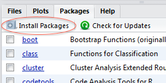
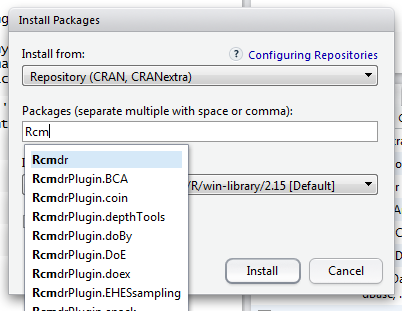
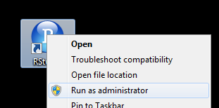
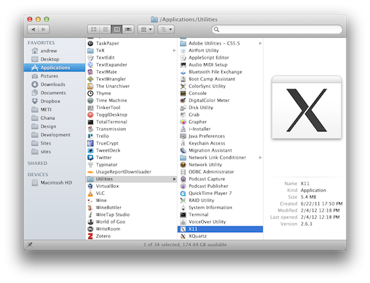
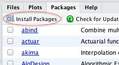
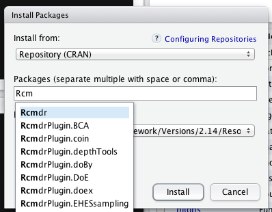

[R](http://www.r-project.org/) is an incredibly powerful open source program for statistics and graphics. It can run on pretty much any computer and has a very active and friendly support community online. Graphics created by R are extremely extensible and are used in high level publications like the New York Times (as explained by [this former NYT infographic designer](http://book.flowingdata.com/)).

[RStudio](http://rstudio.org/) is an integrated development environment (IDE) for R. It's basically a nice front-end for R, giving you a console, a scripting window, a graphics window, and an R workspace, among other options.

[R Commander](http://socserv.mcmaster.ca/jfox/Misc/Rcmdr/) is a basic graphical user interface (GUI) for R. It provides a series of menus that allow you to run lots of statistic tests and create graphics without typing a line of code. More advanced features of R aren't accessible through R Commander, but you can use it for the majority of your statistics. *(Lots of people (like me) use R Commander as a crutch for a few months before they get the hang of the R language. As intimidating as it might be to constantly type stuff at the console, it really is a lot faster.)*

However, as is the case with lots of free and open source software, it can be a little tricky to install all of these different programs and get them to work nicely together. The simple instructions below explain how to get everything working right.

### Install R, RStudio, and R Commander in Windows

1. Download R from [http://cran.us.r-project.org/](http://cran.us.r-project.org/) (click on "Download R for Windows" > "base" > "Download R 2.x.x for Windows")
2. Install R. Leave all default settings in the installation options.
3. Download RStudio from [http://rstudio.org/download/desktop](http://rstudio.org/download/desktop) and install it. Leave all default settings in the installation options.
4. Open RStudio.
5. Go to the "Packages" tab and click on "Install Packages". The first time you'll do this you'll be prompted to choose a CRAN mirror. R will download all necessary files from the server you select here. Choose the location closest to you (probably "USA CA 1" or "USA CA 2", which are housed at UC Berkeley and UCLA, respectively).  

6. Start typing "Rcmdr" until you see it appear in a list. Select the first option (or finish typing Rcmdr), ensure that "Install dependencies" is checked, and click "Install".  

7. Wait while all the parts of the R Commander package are installed.
8. If you get permission errors while installing packages, close R Studio and reopen it with administrator privileges.  

### Install R, RStudio, and R Commander in Mac OS X

1. Download R from [http://cran.us.r-project.org/](http://cran.us.r-project.org/) (click on "Download R for Mac OS X" > "R-2.x.x.pkg (latest version)")
2. Install R.
3. Download RStudio from [http://rstudio.org/download/desktop](http://rstudio.org/download/desktop).
4. Install RStudio by dragging the application icon to your Applications folder.
5. Download Tcl/Tk from [http://cran.r-project.org/bin/macosx/tools/](http://cran.r-project.org/bin/macosx/tools/) (click on `tcltk-8.x.x-x11.dmg`; OS X needs this to run R Commander.)
6. Install Tcl/Tk.
7. Go to your Applications folder and find a folder named Utilities. Verify that you have a program named "X11" there. If not, go to [http://xquartz.macosforge.org/](http://xquartz.macosforge.org/) and download and install the latest version of XQuartz.  

8. Open RStudio.
9. Go to the "Packages" tab and click on "Install Packages". The first time you'll do this you'll be prompted to choose a CRAN mirror. R will download all necessary files from the server you select here. Choose the location closest to you (probably "USA CA 1" or "USA CA 2", which are housed at UC Berkeley and UCLA, respectively).  

10. Start typing "Rcmdr" until you see it appear in a list. Select the first option (or finish typing Rcmdr), ensure that "Install dependencies" is checked, and click "Install".  

11. Wait while all the parts of the R Commander package are installed.

### Open R Commander in Windows and OS X

Once you've installed R Commander, you won't have to go through all those steps again! Running R Commander from this point on is simple—follow the instructions below.

If you decide to stop using R Commander and just stick with R, all you ever need to do is open RStudio—even simpler!

1. Open R Studio
2. In the console, type `windows()` if using Windows, `quartz()` if using Mac OS X. (This tells R Commander to output all graphs to a new window). If you don't do this, R Commander graphs will be output to the graphics window in RStudio.
3. Go to the "Packages" tab, scroll down to "Rcmdr," and check the box to load the plugin. (Alternatively, type `library(Rcmdr)` at the console.)
