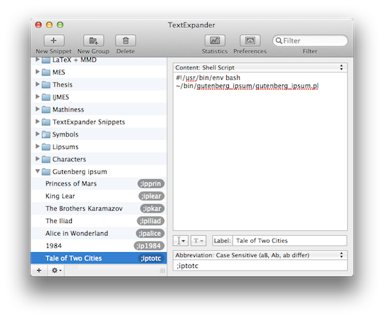

I've decided to try to be more like [Ben Crowder](http://bencrowder.net/), [Tod Robbins](http://www.todrobbins.com/), and [Brett Terpstra](http://brettterpstra.com/) and release my code tinkerings into the public more often.

Since upgrading to [TextExpander 4](http://smilesoftware.com/TextExpander/) a couple weeks ago, I've decided to delve into it a lot more. I recently converted from [Typinator](http://www.ergonis.com/products/typinator/), where I only really used a few expansions for [typing transliterated Arabic](http://www.andrewheiss.com/blog/2009/04/26/typing-transliterated-arabic-quickly/). After belatedly stumbling upon a couple posts by [Brett](http://brettterpstra.com/dammit-again-with-the-lipsum/) and [Dr. Drang](http://www.leancrew.com/all-this/2011/02/dissociated-darwin/), I found that TextExpander can be used for some pretty fun stuff. Like random Lorem Ipsum-like text based on *n*-gram algorithms!

I really liked Dr. Drang's concept of using text from Project Gutenberg to build completely random—yet mostly sensible—dummy text, since the standard "Lorem ipsum" looks really repetitive and boring. Isn't this *Brothers Karamazov*-esque paragraph a lot better?

> Mitya uttered his wild speech. He turned quickly on his way. “Do you suppose gentlemen, that doesn’t care for an escort, for?” I am gone? You won’t be frightened and cry out: ‘I want to join the choir and shout nastiness into both ears,’ while he ran to his bedroom, lay down and I walked along both of us. Dear ones, why do you wait.

Or this Homeric sounding stuff?

> And of bounding steeds: Seven captives next a little space Then rush d amid the bright band: great Ithacus, before, First of mortals! for the gods Then swift pursued her urged, and crown'd Then sunk unpitied to the dire alarms; Both breathing slaughter, follow'd and Patroclus loved remains defend. Beneath.

I made a couple minor modifications to Dr. Drang's original Perl script, clunkily removing paired characters like quotes and parentheses and allowing new corpus files to be specified with the command line, which makes it easier to repeat the code for multiple TextExpander snippets.

Here's how to get it working:

* Copy the script below and save it somewhere on your computer (mine is in `~/bin/gutenberg_ipsum/`).

```perl
#!/usr/bin/perl -w
# Modified from Dr. Drang's original script at http://www.leancrew.com/all-this/2011/02/dissociated-darwin/

use Games::Dissociate;

# Choose the corpus file
if ($#ARGV == -1) {
  $corpus = "totc.txt";
} else {
  $corpus = $ARGV[0];
}

# Slurp in the given corpus as a single string.
open(my $fh, "$ENV{HOME}/bin/gutenberg_ipsum/words/" . $corpus) or die "Can't open";
{local $/; $corpus = <$fh>;}

# Dissociate the corpus, using word pairs, and return 15-50 pairs.
$length = int(15 + rand(35));
$dis = dissociate($corpus, -2, $length);

# Remove quotes and other paired characters, since there might be some that are unmatched
# But this is an incredibly clunky fix. If I had more time/better Perl chops, I'd probably build some algorithm to find unmatched quotes or parentheses and insert them randomly in the text. But that's hard :)
$dis =~ s/[\"\[\]\_\(\)]//gm;

# Capitalize the first word and end it with a period.
$dis =~ s/^(.)/\u$1/;
$dis =~ s/[.);:?'", -]+$/./;

print $dis;
```

* Go to [Project Gutenberg](http://www.gutenberg.org/) and download the full text for some book (or create some other corpus), stripping out the legal text, table of contents, and anything else you don't want the script to use to generate random text. Save that file in some folder on your computer (mine is in `~/bin/gutenberg_ipsum/words/`).
* Modify line 7 of the script to default to your newly downloaded and saved corpus (mine is `totc.txt`, for *A Tale of Two Cities*).
* Modify line 14 to point to wherever you saved your script file and corpus file(s).
* Make the script executable (`chmod +x gutenberg_ipsum.pl` at the terminal).
* Install Games::Dissociate. You can either follow [Dr. Drang's instructions](http://www.leancrew.com/all-this/2011/02/dissociated-darwin/) or use Perl's CPAN shell:
  * Type `sudo perl -MCPAN -e shell` at a terminal and hit enter for each of the configuration options if they haven't been preset previously
  * Type `install Games::Dissociate`
  * Once everything has installed, type `q` to exit the Perl shell
* Test your script by running it from the terminal: `gutenberg_ipsum.pl`. You should get some fun random filler text.
* Use other corpus texts by passing their filenames as arguments: `gutenberg_ipsum.pl alice.txt` for *Alice in Wonderland*, for example. Just make sure a corpus with that name lives in your corpus directory.

Once the script is installed and running, It's trivial to make it work with TextExpander. Make a new Shell Script snippet with this code:

```sh
#!/usr/bin/env bash
~/bin/gutenberg_ipsum/gutenberg_ipsum.pl princessofmars.txt
```

Make as many snippets as you want—one for each of your corpus files. All you need to change in each script is the argument for the file. Replace `princessofmars.txt` with the name of whatever corpus you want that snippet to use.

In the end you can create a good collection of different automatic random filler text from any corpus you want.



If TextExpander 4 allowed its new Fill Ins to work as variables in a shell script, this whole collection could be a lot simpler—it could just be one dropdown menu of all the corpus files in the `words` folder. But since that's not possible, this will have to do.

All the credit to this collection of snippets goes to [Dr. Drang](http://www.leancrew.com/) and [Brett Terpstra](http://brettterpstra.com/). You should read their stuff—really.
