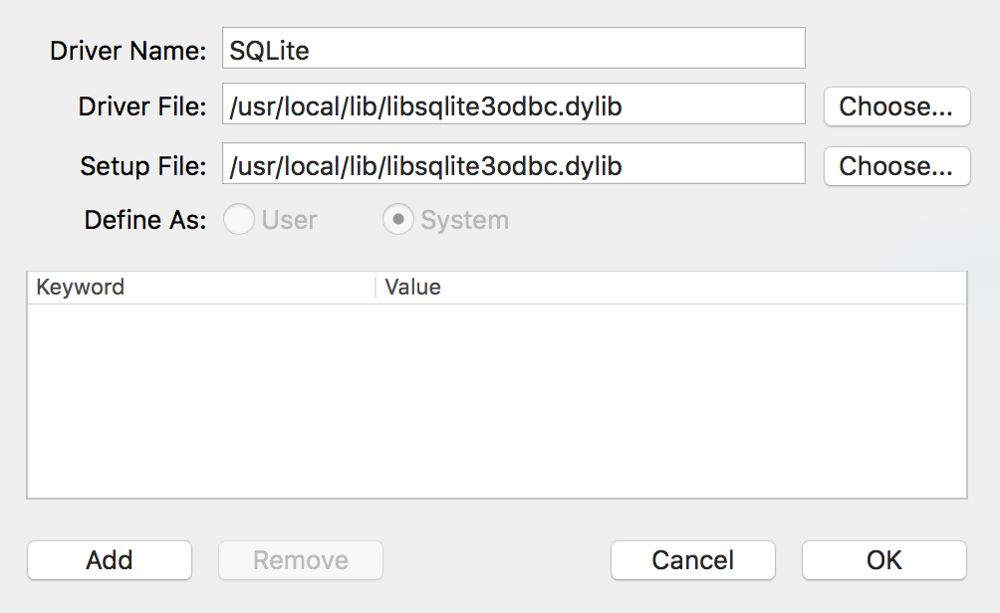
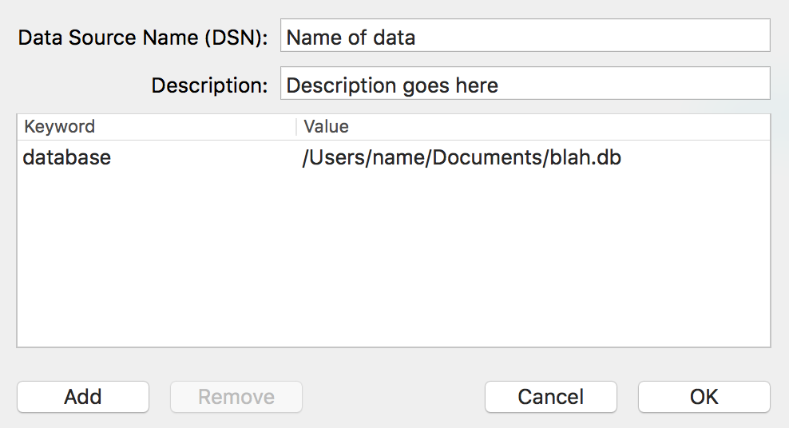
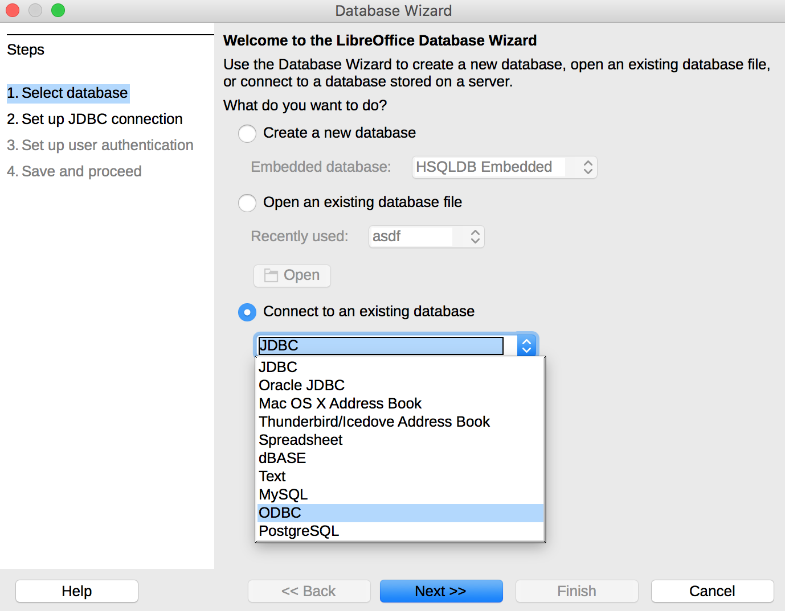
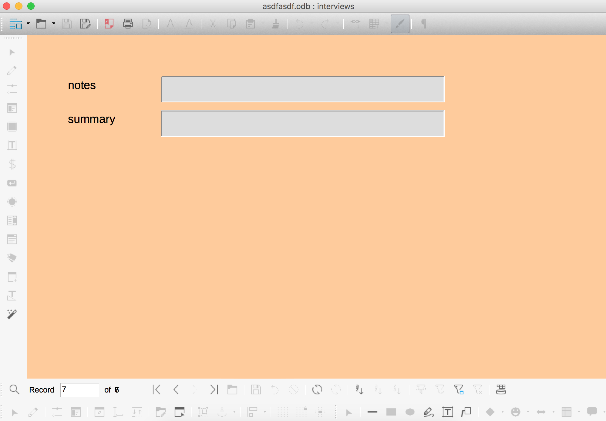

## The problem

As I conduct interviews for my dissertation research, I've been trying to figure out an open source database for storing interview notes and keeping track of the people and organizations I'm talking to. My ideal requirements are simple:

1. The format should be open source.
2. The format should be portable and not require an underlying server (sorry MongoDB and MySQL)—this way I can save the file in an encrypted file container for IRB data protection purposes.
3. The format should be easy to access with multiple languages (especially R and Python), ideally without external dependencies like Java.
4. The format should be compatible with some sort of Microsoft Access-esque form GUI to allow for easy data insertion.

However, finding the right combination of programs and formats has been slightly more difficult. [SQLite](https://sqlite.org/) is the best format, given that it's the [most widely deployed and used database engine](https://sqlite.org/mostdeployed.html) *and* is open source *and* has native support in both [R](https://cran.r-project.org/web/packages/dplyr/)[^1] and [Python](https://docs.python.org/3/library/sqlite3.html). The only thing it lacks is a nice form-based GUI front end.

There are [plenty](http://sqlitebrowser.org/) of [SQLite](https://www.sqlitepro.com/) [viewers](https://addons.mozilla.org/en-US/firefox/addon/sqlite-manager-webext/), but I haven't found any that let you create Access-like forms. I could use Python to program my own GUI (or even get fancy and learn Swift and make a native Cocoa app), but that seems like an excessive amount of work.

[LibreOffice Base](https://www.libreoffice.org/discover/base/) has excellent support for database-backed forms, but under the hood, LibreOffice uses the Java-based [HSQLDB](http://hsqldb.org/), which does not have native R and Python support and requires older Java runtime environments.

## The solution

Fortunately there's a way to use an SQLite database as the backend for LibreOffice Base using an ODBC driver, giving the best of both worlds: an open, universal, Java-free database behind a customizable form-based GUI.

There are [official instructions for doing this on Linux and Windows](https://wiki.openoffice.org/wiki/Documentation/How_Tos/Using_SQLite_With_OpenOffice.org), but there's nothing about doing it in OS X. So here's that missing tutorial.

1. SQLite is already installed on OS X. Create a new SQLite database using `sqlite3` in Terminal (or even easier, use a [GUI](http://sqlitebrowser.org/) [program](https://www.sqlitepro.com/)). Add some tables to it, or don't—it doesn't matter. You just some sort of database file.
2. Download the [SQLite ODBC driver](http://www.ch-werner.de/sqliteodbc/) for OS X. The page includes a link to a precompiled version (*currently it says "Steve Palm kindly provided a build of version 0.9993 for MacOSX 10.{6,7,8,9,10,11} on Intel as installer package (sqliteodbc-0.9993.dmg)"*). Install the driver by opening `sqliteodbc-0.9993.pkg`.
3. Download an ODBC manager app. Prior to OS X 10.5, Apple included one of these, but for whatever reason they stopped with Snow Leopard. There are two that work equally well: [ODBC Manager](http://www.odbcmanager.net/index.php) and [iODBC Administrator](http://www.iodbc.org/dataspace/iodbc/wiki/iODBC/Downloads).
4. Open the ODBC manager/administrator app. Add a new driver using these settings:
    
5. Add a new User DSN (Data Source Name). Create a new key named "database" and use the full absolute path to the SQLite database file as the value:
    
6. Quit the ODBC manager. The SQLite file is now accessible in any program that uses ODBC.
7. Open LibreOffice and create a new Base database. In the wizard, select "Connect to an existing database" and choose "ODBC":
    
8. Click next to select which ODBC database to load. If you click on "Browse…", you should see the name of the SQLite database you set up as a DSN earlier.
9. Click on "Finish." LibreOffice will prompt you to save an `.odf` database. This is fine—it's not actually saving the database, just the accompanying form data.[^2]
10. Create new tables and forms using LibreOffice:
    

Any time you save, all edits will occur on the SQLite file. Create a table, insert some records, and open the SQLite file in a GUI program to see all the changes. Magic!

Even though there are 10 steps, it's not too difficult. tl;dr version: (1) install an SQLite ODBC driver, (2) install an ODBC manager, (3) use the manager to configure the SQLite ODBC driver and connect to an existing SQLite database, and (4) connect to the SQLite database through ODBC with LibreOffice Base.

Perfect!

[^1]:   Technically RSQLite is a separate package, but it's a dependency of [dplyr](https://cran.r-project.org/web/packages/dplyr/index.html), which is as important as base R in my book.

[^2]:   I think… I haven't actually checked or tested this.
