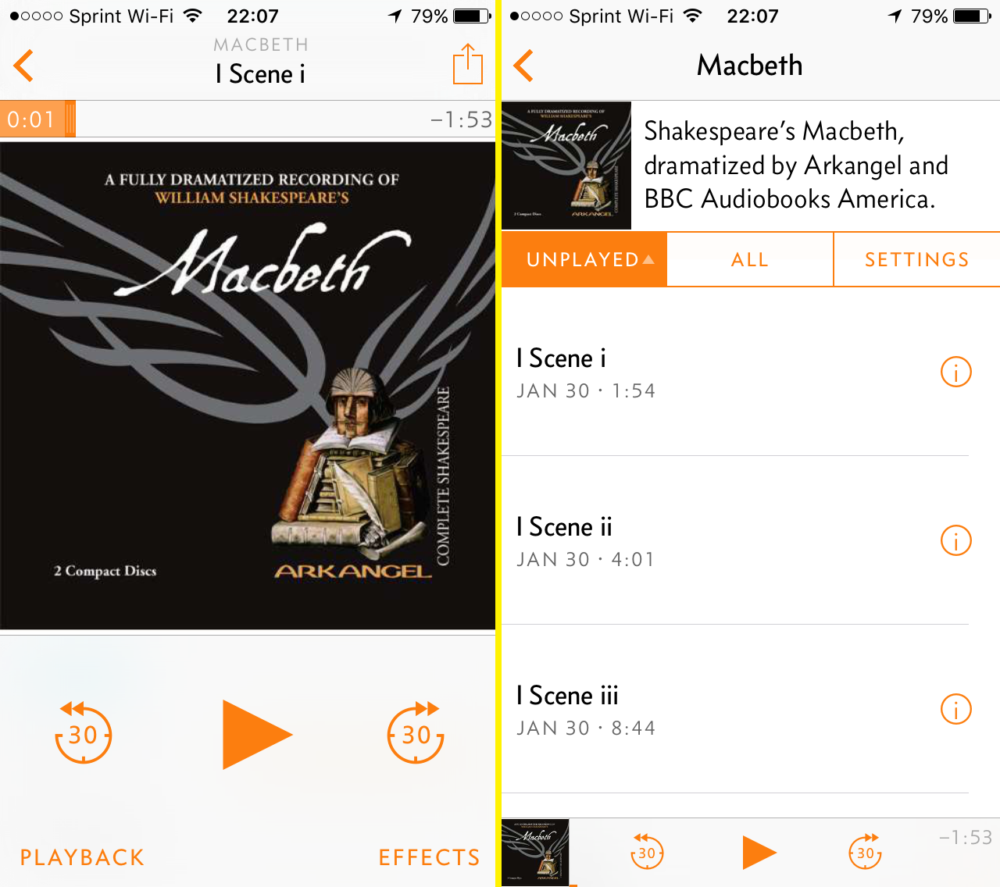

Our public library has a huge collection of books on CD, including a bunch of [well dramatized versions of Shakespeare plays](https://en.wikipedia.org/wiki/Arkangel_Shakespeare) that I've always meant to read. However, out of all the music-listening devices I own, only two have optical drives: the ancient Mac Mini we use for our media center and our minivan. It's trivial to rip the audiobooks to MP3 on the Mac Mini, but I've never been completely happy with the options for listening to them.

I listen to to pretty much all spoken word media on my iPhone or iPad through either [Overcast](https://overcast.fm/) (for podcasts) or the [Audible app](https://www.audible.com/sw) (for audiobooks). Both of these apps allow for faster playback (up to 2.5 or 3x), and Overcast uses the fantastic Smart Speed feature to cut out the silence in between sentences.[^1] Apple's native Music app has none of these extra features, which means I have to listen to CD-based audiobooks at 1x speed like a caveman.

In a perfect world I'd be able fly through these CD-based audiobooks in Overcast.

Behold that perfect world: [Fauxcasts](https://github.com/andrewheiss/fauxcasts). I wrote up a little script that generates a podcast RSS feed from a folder of MP3 files. After running the script, I just have to upload the folder and feed to a server, subscribe to my fake podcast, and listen away.

Get [Fauxcasts from GitHub](https://github.com/andrewheiss/fauxcasts) and make your own temporary podcasts.

[^1]:   Since Overcast came out in July 2014, Smart Speed has saved me an extra 42 hours beyond speed adjustments, which is kind of ridiculously awesome.
