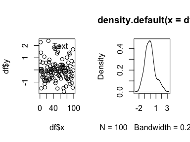

**tl;dr:** Use `pryr::%<a-%` to save a series of R commands as a kind of macro you can call repeatedly.

---

## Saving grid-based plots to objects

One nice thing about ggplot (and grid graphics in general) is that you can save plots as objects and use them later in other functions like `gridExtra::grid.arrange()`:


```r
library(tidyverse)
library(gridExtra)

df <- data_frame(x = 1:100, y=rnorm(100),
                 z=sample(LETTERS[1:3], 100, replace=TRUE))

# Scatterplot
p1 <- ggplot(df, aes(x=x, y=y, color=z)) + geom_point()

# Distribution
p2 <- ggplot(df, aes(x=y, fill=z)) + geom_density(alpha=0.5)

# Combine plots
# arrangeGrob() is basically grid.arrange(), but allows you to save as an object
p.both <- arrangeGrob(p1, p2)
grid::grid.draw(p.both)
```

<!-- -->

This is particularly useful when saving plots with `ggsave`; you can simultaneously make PDF and PNG versions of your plots for use in LaTeX (PDF) or Word, PowerPoint, or HTML (PNG).


```r
ggsave(p.both, filename="blah.pdf")
ggsave(p.both, filename="blah.png")
```

## Saving base graphics-based plots to objects

However, saving base R graphics to objects for later reuse is a little trickier, since plots are built line-by-line into specific devices. One approach is to make plots on a null device, record the plot, and then display it later:


```r
# Save plot to an object using a null PDF device
# http://stackoverflow.com/a/14742001/120898
pdf(NULL)
dev.control(displaylist="enable")
plot(df$x, df$y)
text(40, 0, "Random")
text(60, 2, "Text")
lines(stats::lowess(df$x, df$y))
p1.base <- recordPlot()
invisible(dev.off())

# Display the saved plot
grid::grid.newpage()
p1.base
```

<!-- -->

One advantage of this is that you can then reuse the plot object to simultaneously save a PDF and a PNG without recreating the plot:


```r
pdf("blah_base.pdf")
p1.base
dev.off()

png("blah_base.png")
p1.base
dev.off()
```

This is particularly helpful if you want to use nicer fonts or higher resolutions with Cairo:


```r
cairo_pdf("blah_base.pdf",
          width=8, height=3.5, family="Comic Sans")
p1.base
dev.off()

png("blah_base.png", 
    width=8, height=3.5, family="Comic Sans", 
    bg="white", units="in", res=300, type="cairo")
p1.base
dev.off()
```

There are situations, though, where recorded base graphics plot are clunky and don't work well, since the plots have device information embedded in them. Rearranging saved plots with `par(mfrow()`, `layout()` or [other multipanel techniques](http://seananderson.ca/courses/11-multipanel/multipanel.pdf) can be tricky. Saved plots that make heavy modifications to `par()` (like Sankey diagrams created from the [riverplot package](https://cran.r-project.org/web/packages/riverplot/index.html)) can also be unwieldy when laying out with multiple base graphics plots. It seems that the best way to use multipanel techniques with base R is to use the actual plot commands rather than inserting recorded plots. Which means that if you want to simultaneously output a PNG and a PDF, you have to repeat the code twice, which is awful.


<!-- -->


```r
pdf("blah.pdf")
split.screen(c(1, 2))

screen(1)
plot(df$x, df$y)
text(40, 0, "Random")
text(60, 2, "Text")
lines(stats::lowess(df$x, df$y))

screen(2)
plot(density(df$y))

close.screen(all=TRUE) 
dev.off()

# Once more, with feeling
png("blah.png")
split.screen(c(1, 2))

screen(1)
plot(df$x, df$y)
text(40, 0, "Random")
text(60, 2, "Text")
lines(stats::lowess(df$x, df$y))

screen(2)
plot(density(df$y))

close.screen(all=TRUE) 
dev.off()
```

## A solution: active bindings in `pryr`

Instead of recording a plot and saving all its device-specific settings, you can use the `%<a-%` function in [Hadley Wickham's `pryr`](https://github.com/hadley/pryr) package to essentially [save a chunk of R code as an object that can then be re-run later](https://stackoverflow.com/questions/29583849/r-saving-a-plot-in-an-object), almost like a macro.


```r
library(pryr)

p1.pryr %<a-% {
  plot(df$x, df$y)
  text(40, 0, "Random")
  text(60, 2, "Text")
  lines(stats::lowess(df$x, df$y))
}

p2.pryr %<a-% {
  plot(density(df$y))
}
```

Every time `p1.pryr` is called from now on, R will run everything assinged to it in `{}`. The plot itself is not saved as an object—rather, the code that generates the plot is saved as an object.


```r
p1.pryr
```

<!-- -->

```r
p2.pryr
```

<!-- -->

Including these plots in a multipanel layout is trivial:


```r
split.screen(c(1, 2))

screen(1)
p1.pryr

screen(2)
p2.pryr

close.screen(all=TRUE) 
```

<!-- -->

Saving these plots as PDFs and PNGs is the same as saving recorded plots:

```r
pdf("blah_base_pryr.pdf")
p1.pryr
dev.off()

png("blah_base_pryr.png")
p1.pryr
dev.off()
```

But even better is saving multipanel plots as PDFs and PNGs. Save the whole multipanel plot code as an actively bound object and then wrap it in `pdf()` or `png()`:


```r
p.both.pryr %<a-% {
  split.screen(c(1, 2))

  screen(1)
  p1.pryr
  
  screen(2)
  p2.pryr
  
  close.screen(all=TRUE)
}

pdf("blah_base_both_pryr.pdf")
p.both.pryr
dev.off()

png("blah_base_both_pryr.png")
p.both.pryr
dev.off()
```

Again, actively bound objects are *not* the objects themselves, but an expression that gets run every time the object is accessed. It is far easier to deal with saved base graphics as code instead of as recorded plots, since there is no inherent device information to contend with.

In the end, it's easiest to save grid-based graphics to objects, since they're designed to do that. But you can fake it with base graphics using `pryr`.

---

One quick real-world use case. As mentioned, Sankey diagrams from [riverplot package](https://cran.r-project.org/web/packages/riverplot/index.html) override all graphical parameters and can't be easily plotted in multipanel layouts if you record them with `recordPlot()`. With `pryr`, though, it's easy.


```r
library(riverplot)

x <- riverplot.example()

riverplot.saved %<a-% {
  plot(x)
  text(3, 0, "Some text\n", adj=c(0.5, -0.5), font=2)
  points(1:5, rep(2, 5), pch=19)
}

p.both.river %<a-% {
  split.screen(c(1, 2))

  screen(1)
  riverplot.saved
  
  screen(2)
  plot(1:10)
  
  close.screen(all=TRUE)
}

p.both.river
```

<!-- -->

