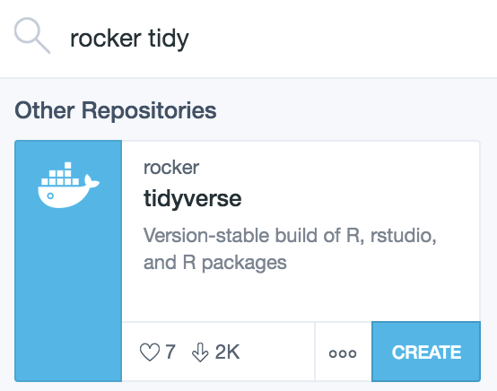
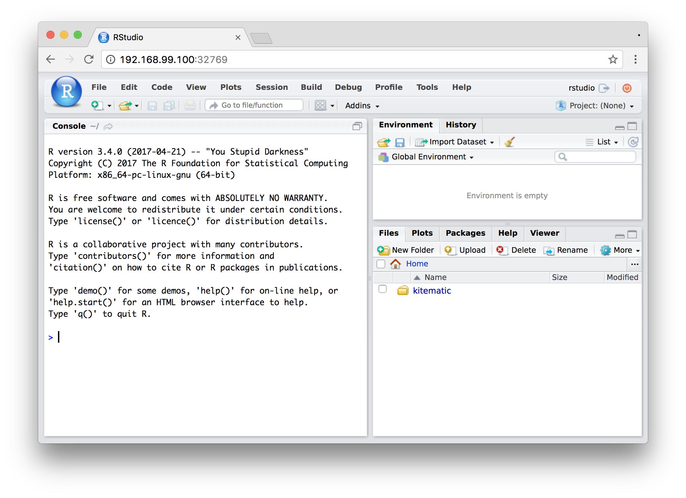
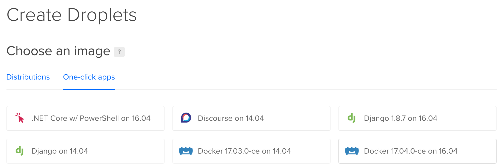
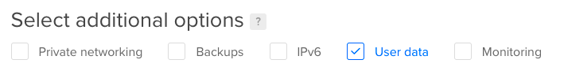
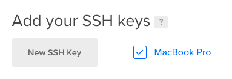
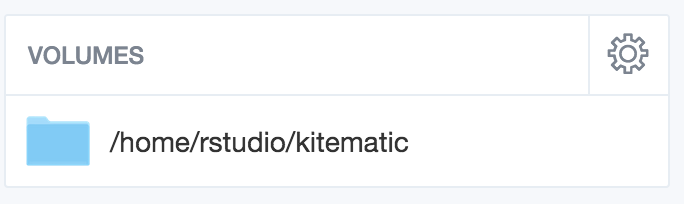
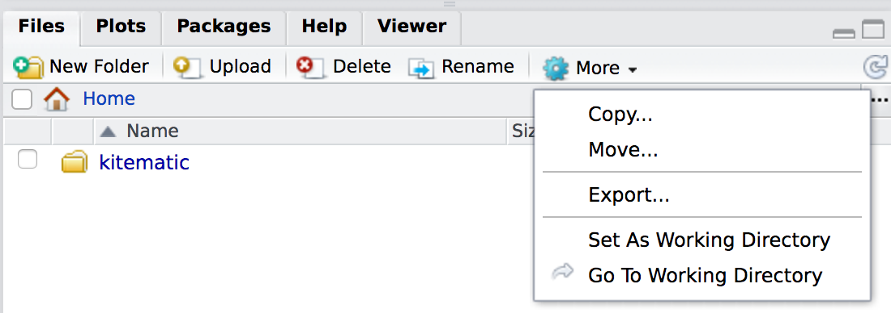
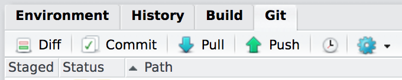

All the cool data science kids seem to be using [Docker](https://www.docker.com/) these days, and being able to instantly spin up a pre-built computer with a complete development or production environment is magic. The R community has also jumped on the Docker whale, and [rOpenSci](https://ropensci.org/) maintains [dozens of pre-built Docker images](https://hub.docker.com/u/rocker/). [These images are well documented](https://ropensci.org/blog/blog/2014/10/23/introducing-rocker) and there are [helpful guides explaining how to get started](https://github.com/rocker-org/rocker/wiki/Using-the-RStudio-image).

Read all that first. This post doesn't explain how Docker works. Instead, it's a quick super basic beginner's guide about how I use these Docker images in real-world R development and research.

**Contents:**

- [Why even do this](#why-even-do-this)
- [Run locally with a GUI](#run-locally-with-a-gui)
- [Run on a remote server](#run-on-a-remote-server)
- [Getting stuff in and out of the container](#getting-stuff-in-and-out-of-the-container)
- [Running on a remote server without RStudio](#running-on-a-remote-server-without-rstudio)
- [Making a custom Dockerfile](#making-a-custom-dockerfile)

---

## Why even do this

I've found two general reasons for running R in a Docker container:

1. **Reproducibility and consistent development environments**: Python virtual environments are awesome—anyone can install all the packages/libraries your script needs in a local Python installation. R doesn't have virtual environments. R has [`packrat`](https://rstudio.github.io/packrat/), which is incorporated into RStudio, but it's a hassle and I hate using it and can never get it working right.

    Instead of using packrat, you can develop an R project within a Docker container. (This idea comes from a [Twitter conversation](https://twitter.com/noamross/status/842196567050330112) with [@noamross](https://twitter.com/noamross).) Create a custom Dockerfile for your project where you install any additional packages your project needs ([more on that below](#making-a-custom-dockerfile)), and then develop your project in the browser-based RStudio from the container. (Or, be lazy like me and keep developing in your local R installation without containers and periodically check to make sure it all works in a pristine development environment in a container).

    All someone needs to do to run your project is pull the Docker image for your project, which will already have all the packages and dependencies and extra files installed.

    In an ideal world, you can create a Dockerfile for a specific project, develop everything in RStudio in the browser, and the distribute both the [Dockerfile](https://github.com/andrewheiss/docker-donors-ngo-restrictions) and the [project repository](https://github.com/andrewheiss/donors-ngo-restrictions) so others can reproduce everything.

2. **Offloading computationally intensive stuff**: I often build Bayesian models with [Stan](http://mc-stan.org/) and [`rstanarm`](http://mc-stan.org/interfaces/rstanarm). Complicated Bayesian models take forever to run, though, because of long Monte Carlo Markov chains (it takes hours to run dozens of Bayesian random effects effects models with `rstanarm::stan_glmer()`, for instance). Rather than tie up my computer and make it so I can't put it to sleep, I create a virtual server on [DigitalOcean](https://www.digitalocean.com/) and run these intensive scripts in a Docker container there.


## Run locally with a GUI

The easiest possible way to play with Docker is to use [Kitematic](https://kitematic.com/), Docker's own cross-platform GUI. Kitematic automatically installs Docker and all its dependencies and it runs a virtual Linux machine in the background, which *then* runs Docker inside. With Kitematic you can search for public images and builds on [Docker Hub](https://hub.docker.com) and manage all your running containers without having to deal with the command line.

1. Download and install [Kitematic](https://kitematic.com/)
2. Search for a Docker image, like [`rocker/tidyverse`](https://hub.docker.com/r/rocker/tidyverse/) and create it

    

3. Access a containerized RStudio installation at the URL shown in Kitematic (in this case `192.168.99.100:32769` (default username and password are both `rstudio`)

    

4. Stop the container when you're all done

## Run on a remote server

Running a container remotely lets you offload computationally intensive tasks. There's no fancy GUI for starting remote containers, but it's easy enough.

1. Create a [DigitalOcean droplet](https://www.digitalocean.com/). Use one of the pre-built Docker one-click apps and choose some size for your server (number of CPUs and amount of RAM).

    

2. Once the server is live, log into it via `ssh` from your local machine: `ssh root@ip_address_here`
3. Get the latest version of the Docker image of your choice by typing `docker pull rocker/tidyverse`
4. Run that image `docker run -d -p 8787:8787 rocker/tidyverse`
5. Access the remote RStudio installation at `ip_address_here:8787`
6. Stop the container or destroy the DigitalOcean droplet when you're done.

Bonus things:

- If you select "User data" in the additional options section when creating the droplet, you can paste a [`cloud-config`](https://www.digitalocean.com/community/tutorials/how-to-use-cloud-config-for-your-initial-server-setup) file that contains a list of directives to run when the droplet is initialized.

    

    You can use this to automatically pull and run the Docker image when you create the droplet so there's no need to even SSH into the new machine. Just wait a couple minutes for Docker to do its thing and you'll have an RStudio installation waiting at `ip_address_here:8787`.

    Here's a basic `cloud-config` file I use to automatically start the server and set a password:

    ```text
    #cloud-config
    runcmd:
      - docker run -d -p 8787:8787 -e PASSWORD=supersekrit rocker/tidyverse
    ```

- If you [upload your public SSH key to DigitalOcean](https://www.digitalocean.com/community/tutorials/how-to-use-ssh-keys-with-digitalocean-droplets) you can automatically add it to the droplet when creating it, making it so you can log in via SSH without a password.

    


## Getting stuff in and out of the container

When you pull an image from Docker Hub, they're typically empty and pristine. You have to add your own files and data. Also, Docker containers are ephemeral. Once you stop running a container, any data stored in it disappears—when you start the container again, it'll be back in its pristine state.

There are multiple ways to get files in and out of a container though:

- **Locally mounted volume**: It's possible to run a Docker container that mounts a local folder into the container's file system, making local files accessible to the container. Setting this up in Kitematic is trivial—change the container's "Volumes" setting to map the built-in `kitematic` folder to some local directory on your computer, and anything you save in the `kitematic` folder within the container will actually be saved on your computer. Setting this up from terminal (like on a remote computer) is trickier (Google "docker mount local directory"). However, since I create and delete remote servers willy nilly, I don't ever really get around to mounting directories remotely.

    

- **Upload and download with RStudio**: You can use the "Upload" button in the "Files" panel in RStudio to get individual files or whole directories into the container. Use "More > Export" to download files.

    

- **git**: You can clone and pull a git repository using RStudio.

    


## Running on a remote server without RStudio

When running computationally intensive stuff, RStudio in the browser can sometimes cause problems. I often can't get back into the session if it's stuck running a script for hours, meaning I just have to trust that it's working, which is awful.

Instead, I run long scripts in the background without using RStudio and monitor them using a log file.

1. Log in to the remote server with `ssh`.
2. Find the name or the ID of the Docker container that's running RStudio by running `docker ps`
3. Connect to that container by running `docker exec -it hash_of_container bash` (like `fcab1f00f1d1`) or `docker exec -it name_of_container bash`. You're now inside the container.
4. Navigate to the script you want to run: `cd home/rstudio/name_of_your_file.R`
5. Run the script. There are a billion different ways to do this, like with `screen` or `tmux` or `dtach`. I find it easiest to use `nohup` and redirect the output of the script to a log file. I run `nohup Rscript name_of_your_file.R > process_of_script.log 2>&1 &` to send all output to `process_of_script.log`.
6. Monitor the script periodically. You can do this in RStudio by logging in and opening the log file (and because the script is running in the background, there won't be any problems restoring an RStudio session), or by typing `tail process_of_script.log` from the terminal inside the container.


## Making a custom Dockerfile

The [base `rocker/tidyverse` container](https://hub.docker.com/r/rocker/tidyverse/) has most of the packages I typically need for projects, but I also regularly use packages that it doesn't have by default, like [`pander`](https://rapporter.github.io/pander/), [`ggstance`](https://cran.r-project.org/web/packages/ggstance/index.html), and [`countrycode`](https://cran.r-project.org/web/packages/countrycode/index.html).  Because containers come in a pristine state, you have to install all additional packages by hand in a new container, which is tedious and not reproducible.

To fix this, you can create your own Dockerfile that is based on another Dockerfile. This is actually what all the rocker images do—they're based on a  basic [`rocker/r-base`](https://hub.docker.com/r/rocker/rstudio/~/dockerfile/) image and then add additional installation commands and directives (for instance, `rocker/tidyverse` is based on `rocker/rstudio` which is based on `rocker/r-base`). If you make your own Dockerfile based on your favorite rocker image, you can host it as an automated build on Docker Hub and then pull it just like any other image.

Making Dockerfiles is tricky and full of tons of options that are well covered elsewhere. Here are some examples I've made:

- [**Super basic easy example**](https://hub.docker.com/r/andrewheiss/docker-example-r-environment/~/dockerfile/): This is `rocker/tidyverse` with the CRAN versions of `pander`, `stargazer`, `countrycode`, and `WDI` and the development version of `ggrepel`.
- [**`tidyverse_rstanarm`**](https://hub.docker.com/r/andrewheiss/tidyverse-rstanarm/~/dockerfile/): This installs Stan and `rstanarm` in the `rocker/tidyverse` image. Installing Stan from source is tricky and it took me hours to get the right incantation of commands, but it works!
- [**`docker-donors-ngo-restrictions`**](https://hub.docker.com/r/andrewheiss/docker-donors-ngo-restrictions/~/dockerfile/): This is `tidyverse_rstanarm` with all the packages needed for a [specific project](https://github.com/andrewheiss/donors-ngo-restrictions). It does fancy stuff like installing custom fonts and some Python packages.

You can host these custom Dockerfiles on GitHub and connect them to Docker Hub as automated builds. Every time you push to the GitHub repository, Docker Hub will automatically rebuild the image so when people run `docker pull repository/name`, they'll get the latest version. Magic.
