For whatever reason, I decided to start reading Tolstoy's *War and Peace* (via Audible) the week I had to turn in my dissertation. I still have a dozen or so hours to go, but the book has been incredible. I had no idea what it was about going into it, and was delighted to find that the "war" parts of the book deal with the Napolonic wars—both his 1804–1805 campaign in the [War of the Third Coalition](https://en.wikipedia.org/wiki/War_of_the_Third_Coalition) (like the [Battle of Austerlitz](https://en.wikipedia.org/wiki/Battle_of_Austerlitz)), and his [1812 campaign to invade Russia](https://en.wikipedia.org/wiki/French_invasion_of_Russia), from whence we get [Tchaikovsky's *1812 Overture*](https://en.wikipedia.org/wiki/1812_Overture). I knew *nothing* about these wars and Tolstoy's descriptions are incredible and gripping.

It's been especially exciting because I'm preparing a course on data visualization this fall and had been looking forward to using [Charles Minard's famous plot](https://en.wikipedia.org/wiki/Charles_Joseph_Minard#Work) about Napoleon's 1812 winter retreat from Moscow, where the Grande Armée dropped from 422,000 to 10,000 troops.


Edward Tufte has said that Minard's plot "may well be the best statistical graphic ever drawn" because it manages to pack a ton of information into one dense figure. The plot contains six variables, each mapped to a different aesthetic:

| Information                           | Aesthetic       |
|---------------------------------------|-----------------|
| Size of Napoleon's Grande Armée       | Width of path   |
| Longitude of the army's position      | x-axis          |
| Latitude of the army's position       | y-axis          |
| Direction of the army's movement      | Color of path   |
| Date of points along retreat path     | Text below plot |
| Temperature during the army's retreat | Line below plot |

Designers and statisticians have recreated this plot dozens of times—there are [galleries of attempts](http://www.datavis.ca/gallery/re-minard.php) all around the internet. It's even included in Hadley Wickham's [original article introducting `ggplot2`](http://vita.had.co.nz/papers/layered-grammar.pdf). Creating the plot in R is fairly trivial and [requires minimal code](http://www.datavis.ca/gallery/minard/ggplot2/minard.r), thanks to ggplot's clear grammar for data graphics.

In the seven years since Hadley's original article, ggplot and R have matured significantly (thanks, in large part, due to the [tidyverse](http://www.tidyverse.org/)). With these improvements, we can add fancier elements to the basic ggplot Minard plot and play around with some fun R features.


## Getting started

First, we load the necessary libraries and data (data available at [Michael Friendly's Minard gallery](http://www.datavis.ca/gallery/re-minard.php) or in the [GitHub repository for this notebook](https://github.com/andrewheiss/fancy-minard/tree/master/input/minard).)


```r
library(tidyverse)
library(lubridate)
library(ggmap)
library(ggrepel)
library(gridExtra)
library(pander)

cities <- read.table("input/minard/cities.txt",
                     header = TRUE, stringsAsFactors = FALSE)

troops <- read.table("input/minard/troops.txt",
                     header = TRUE, stringsAsFactors = FALSE)

temps <- read.table("input/minard/temps.txt",
                    header = TRUE, stringsAsFactors = FALSE) %>%
  mutate(date = dmy(date))  # Convert string to actual date
```


## Geography

The troops data includes five variables about troop movement: location, number of survivors, direction (advancing or retreating) and group (since Napoleon had generals commanding different elements of the army).


```r
troops %>% head() %>% pandoc.table()
```

| long | lat  | survivors | direction | group |
|:----:|:----:|:---------:|:---------:|:-----:|
|  24  | 54.9 |  340000   |     A     |   1   |
| 24.5 |  55  |  340000   |     A     |   1   |
| 25.5 | 54.5 |  340000   |     A     |   1   |
|  26  | 54.7 |  320000   |     A     |   1   |
|  27  | 54.8 |  300000   |     A     |   1   |
|  28  | 54.9 |  280000   |     A     |   1   |

Each of these variables maps well into ggplot's aesthetic-based paradigm. If we include just geographic and group information (so there are separate lines for the different divisions), we get a basic skeleton of the original plot:


```r
ggplot(troops, aes(x = long, y = lat, group = group)) +
  geom_path()
```

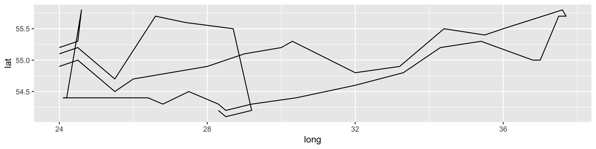


We can map data to other aesthetics, like color and size:


```r
ggplot(troops, aes(x = long, y = lat, group = group,
                   color = direction, size = survivors)) +
  geom_path()
```

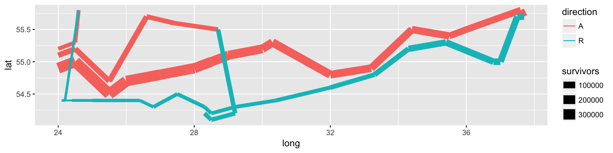

The individual segments of the path don't fit together very well and leave big gaps. We can fix that by adding a rounded line ending to each segment.


```r
ggplot(troops, aes(x = long, y = lat, group = group,
                   color = direction, size = survivors)) +
  geom_path(lineend = "round")
```

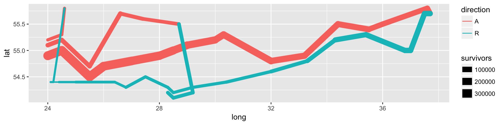

The size of the path hides the drama of the plot. Napoleon started the 1812 campaign with 422,000 troops and returned with only 10,000. ggplot automatically makes discrete categories for the `survivors` variable, resulting in three not-very-granular categories. We can adjust the scale to allow for more categories, thus showing more variation in size and highlighting the devasation of the army:


```r
ggplot(troops, aes(x = long, y = lat, group = group,
                   color = direction, size = survivors)) +
  geom_path(lineend = "round") +
  scale_size(range = c(0.5, 15))
```

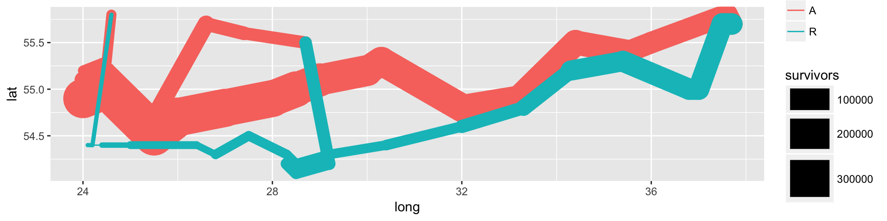

Finally, we can remove the labels, legends, and change the colors to match <span style="color:#DFC17E;">the shade of brown</span> from Minard's original plot (which I figured out with Photoshop's eyedropper tool).


```r
ggplot(troops, aes(x = long, y = lat, group = group,
                   color = direction, size = survivors)) +
  geom_path(lineend = "round") +
  scale_size(range = c(0.5, 15)) +
  scale_colour_manual(values = c("#DFC17E", "#252523")) +
  labs(x = NULL, y = NULL) +
  guides(color = FALSE, size = FALSE)
```

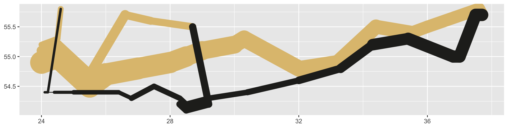

One of the amazing things about this plot is that it is actually a map—the x and y axes show the longitude and latitude of the troops. This means we can overlay geographic details, like cities. The cities in the original data can easily be added with `geom_point()` and `geom_text()`. We use `vjust` in `geom_text()` to move the labels down away from their points.

(Now that we're adding graphical layers from different sources, it's good to move the aesthetics defined in `aes()` to the layers where they're actually used.)


```r
ggplot() +
  geom_path(data = troops, aes(x = long, y = lat, group = group,
                               color = direction, size = survivors),
            lineend = "round") +
  geom_point(data = cities, aes(x = long, y = lat)) +
  geom_text(data = cities, aes(x = long, y = lat, label = city), vjust = 1.5) +
  scale_size(range = c(0.5, 15)) +
  scale_colour_manual(values = c("#DFC17E", "#252523")) +
  labs(x = NULL, y = NULL) +
  guides(color = FALSE, size = FALSE)
```

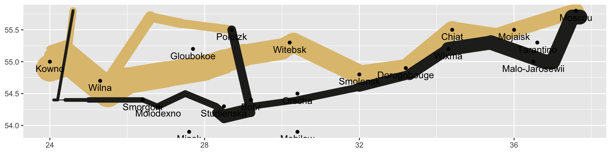

Alternatively, we can use `geom_text_repel` from the [`ggrepel` package](https://github.com/slowkow/ggrepel) to automatically move the labels away from points and to ensure none of the labels overlap. We can also adjust the labels so they're easier to read (using [Open Sans](https://fonts.google.com/specimen/Open+Sans)).


```r
ggplot() +
  geom_path(data = troops, aes(x = long, y = lat, group = group,
                               color = direction, size = survivors),
            lineend = "round") +
  geom_point(data = cities, aes(x = long, y = lat),
             color = "#DC5B44") +
  geom_text_repel(data = cities, aes(x = long, y = lat, label = city),
                  color = "#DC5B44", family = "Open Sans Condensed Bold") +
  scale_size(range = c(0.5, 15)) +
  scale_colour_manual(values = c("#DFC17E", "#252523")) +
  labs(x = NULL, y = NULL) +
  guides(color = FALSE, size = FALSE)
```

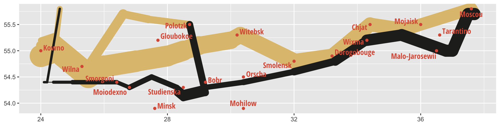

Also, because this is a map, we can overlay it on other maps. It's fairly easy to get map data from Google or from the [OpenStreetMap project](https://www.openstreetmap.org/) (through the [Stamen project](http://maps.stamen.com/)) with the [`ggmap` package](https://github.com/dkahle/ggmap). There are some weird quirks you have to deal with, though:

- You can supply `ggmap` with a four-number bounding box to get a specific region of a map. OpenStreetMap makes this really easy to do. Vavigate to the area you want to map at openstreetmap.org and click on "Export" in the top toolbar. The left sidebar should show the latitudes and longitudes for the current view. If you click on "Manually select a different area," you can create your own bounding box.

    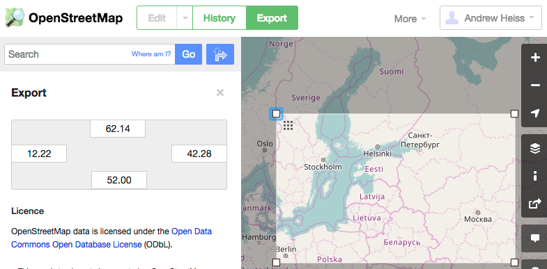

- OpenStreetMap is the only data source ggmap uses that can use exact bounding boxes. When you use Google as a source, Google will find the center of the bounding box and estimate the region you want, and it's often wrong and will get too much of the map (or too little). OpenStreetMap is thus better for getting exact areas.
- BUUUUUT [OpenStreetMap no longer allows ggmap to access its API](https://github.com/dkahle/ggmap/issues/117), which stinks. Fortunatley, the [Stamen project](http://maps.stamen.com/) *does* work with `ggmap`, and it's based on OpenStreetMap data, so all is well(ish).

With those caveats, we can get map tiles from Stamen with `get_stamenmap()`:


```r
march.1812.europe <- c(left = -13.10, bottom = 35.75, right = 41.04, top = 61.86)

# "zoom" ranges from 3 (continent) to 21 (building)
# "where" is a path to a folder where the downloaded tiles are cached
march.1812.europe.map <- get_stamenmap(bbox = march.1812.europe, zoom = 5,
                                       maptype = "terrain", where = "cache")
```

Once we have the tiles, the `ggmap()` function plots them nicely:


```r
ggmap(march.1812.europe.map)
```

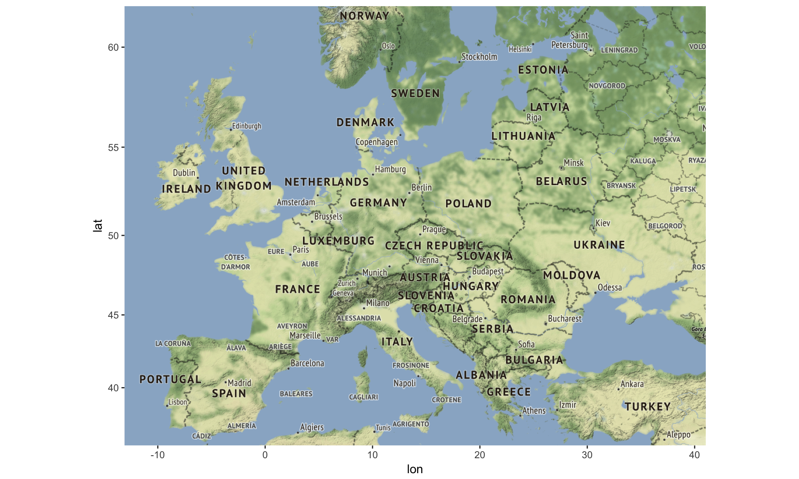

We can even use Stamen's fancier map types, like watercolor:


```r
march.1812.europe.map.wc <- get_stamenmap(bbox = march.1812.europe, zoom = 5,
                                          maptype = "watercolor", where = "cache")
ggmap(march.1812.europe.map.wc)
```

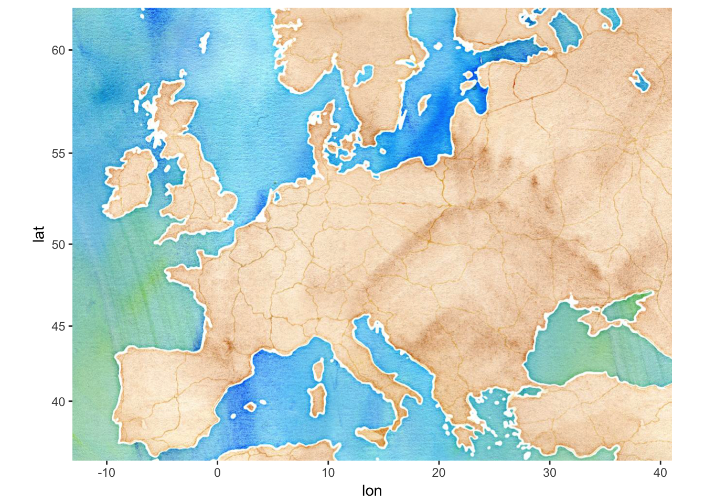

Now we can overlay the Minard plot to see where the march took place in relation to the rest of Europe:


```r
ggmap(march.1812.europe.map.wc) +
  geom_path(data = troops, aes(x = long, y = lat, group = group,
                               color = direction, size = survivors),
            lineend = "round") +
  scale_size(range = c(0.5, 5)) +
  scale_colour_manual(values = c("#DFC17E", "#252523")) +
  guides(color = FALSE, size = FALSE) +
  theme_nothing()  # This is a special theme that comes with ggmap
```

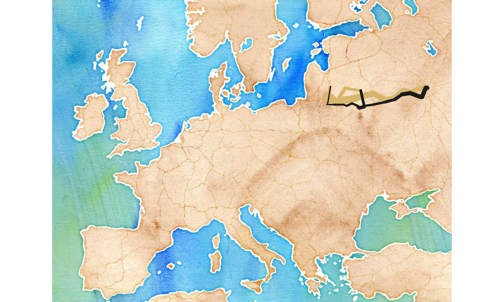

We can also zoom in on just northeastern Europe and add the cities back in. We'll save this plot to an object (`march.1812.plot`) so we can use it later.


```r
march.1812.ne.europe <- c(left = 23.5, bottom = 53.4, right = 38.1, top = 56.3)

march.1812.ne.europe.map <- get_stamenmap(bbox = march.1812.ne.europe, zoom = 8,
                                          maptype = "terrain-background", where = "cache")

march.1812.plot <- ggmap(march.1812.ne.europe.map) +
  geom_path(data = troops, aes(x = long, y = lat, group = group,
                               color = direction, size = survivors),
            lineend = "round") +
  geom_point(data = cities, aes(x = long, y = lat),
             color = "#DC5B44") +
  geom_text_repel(data = cities, aes(x = long, y = lat, label = city),
                  color = "#DC5B44", family = "Open Sans Condensed Bold") +
  scale_size(range = c(0.5, 10)) +
  scale_colour_manual(values = c("#DFC17E", "#252523")) +
  guides(color = FALSE, size = FALSE) +
  theme_nothing()

march.1812.plot
```

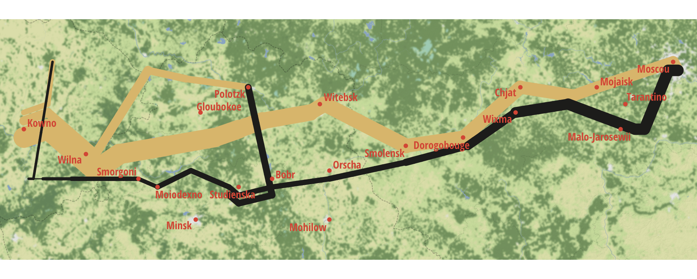

Magic!


## Temperatures and time

So far we have four of the variables from Minard's original plot—we're still missing the temperatures during the retreat and the days of the retreat. Minard put this infomration in a separate plot under the map, which is fairly easy to do with [`gridExtra`](https://cran.r-project.org/web/packages/gridExtra/index.html).

First we have to create the panel, which is a basic line graph with longitude along the x-axis and temperature along the y-axis, with text added at each point.


```r
ggplot(data = temps, aes(x = long, y = temp)) +
  geom_line() +
  geom_text(aes(label = temp), vjust = 1.5)
```

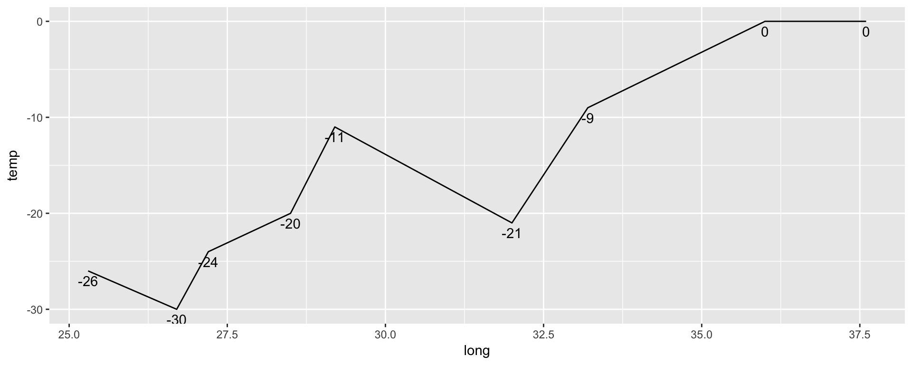

We can create a new variable for nicer labels, combining temperature with the date. We'll also clean up the theme, move the axis label to the right, and only include major horizontal gridlines. When we overlay the two plots, we have to make sure the x-axes align, so we need to use the same x-axis limits used in `march.1812.plot`. Those limits are buried inside the plot object, the parts of which can be accessed with `ggplot_build()`:


```r
ggplot_build(march.1812.plot)$layout$panel_ranges[[1]]$x.range
```

```r
## [1] 23.5 38.1
```


```r
temps.nice <- temps %>%
  mutate(nice.label = paste0(temp, "°, ", month, ". ", day))

temps.1812.plot <- ggplot(data = temps.nice, aes(x = long, y = temp)) +
  geom_line() +
  geom_label(aes(label = nice.label),
            family = "Open Sans Condensed Bold", size = 2.5) +
  labs(x = NULL, y = "° Celsius") +
  scale_x_continuous(limits = ggplot_build(march.1812.plot)$layout$panel_ranges[[1]]$x.range) +
  scale_y_continuous(position = "right") +
  coord_cartesian(ylim = c(-35, 5)) +  # Add some space above/below
  theme_bw(base_family = "Open Sans Condensed Light") +
  theme(panel.grid.major.x = element_blank(),
        panel.grid.minor.x = element_blank(),
        panel.grid.minor.y = element_blank(),
        axis.text.x = element_blank(), axis.ticks = element_blank(),
        panel.border = element_blank())

temps.1812.plot
```

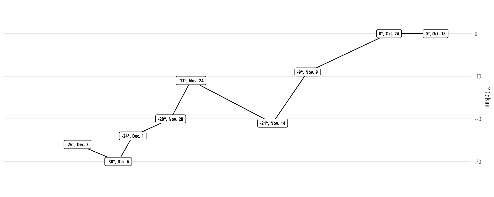


## Combining the plots

Finally, we use functions in `gridExtra` to combine the two plots. The easiest way to combine plot objects with `gridExtra` is to use `grid.arrange()`, but doing so doesn't align the axes of the plot. For instance, look at these two example plots—they're no longer comparable vertically because the left side of the bottom plot extends to the edge of the plot, expanding under the long axis label in the top plot:


```r
example.data <- data_frame(x = 1:10, y = rnorm(10))

plot1 <- ggplot(example.data, aes(x = x, y = y)) +
  geom_line() +
  labs(y = "This is a really\nreally really really\nreally tall label")

plot2 <- ggplot(example.data, aes(x = x, y = y)) +
  geom_line() +
  labs(y = NULL)

grid.arrange(plot1, plot2)
```

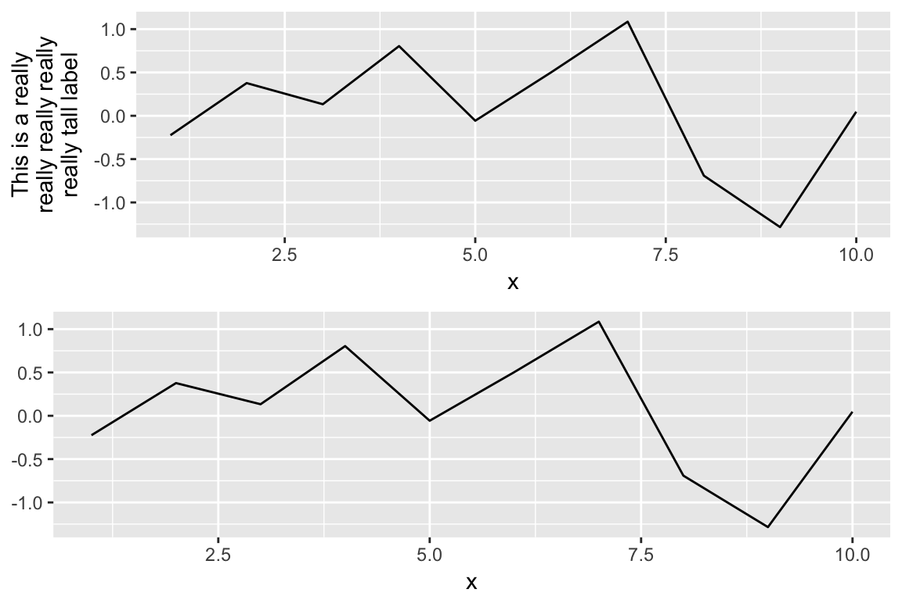

Instead of using `grid.arrange`, we can use `gridExtra`’s special version of `rbind()` (or `cbind()`) for `ggplotGrob` objects:


```r
plot.both <- rbind(ggplotGrob(plot1),
                   ggplotGrob(plot2))

grid::grid.newpage()
grid::grid.draw(plot.both)
```

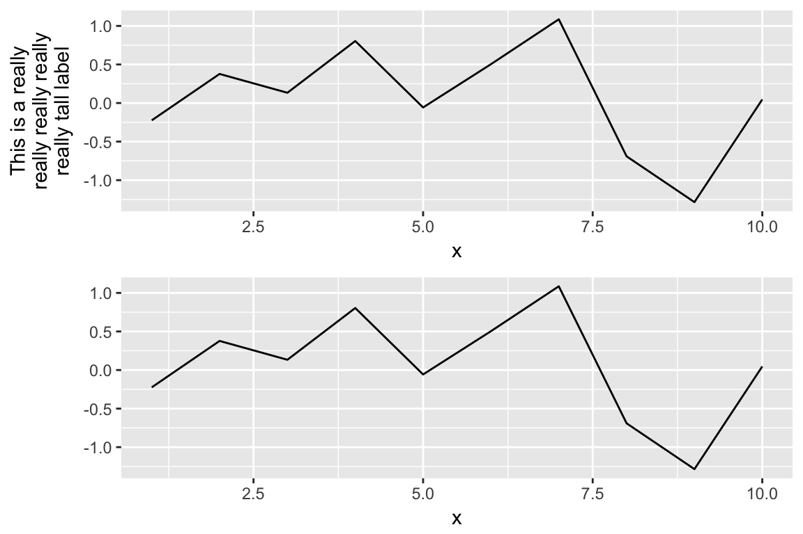

Now that we can align plots correctly, we can combine the map and the temperature:


```r
both.1812.plot <- rbind(ggplotGrob(march.1812.plot),
                        ggplotGrob(temps.1812.plot))

grid::grid.newpage()
grid::grid.draw(both.1812.plot)
```

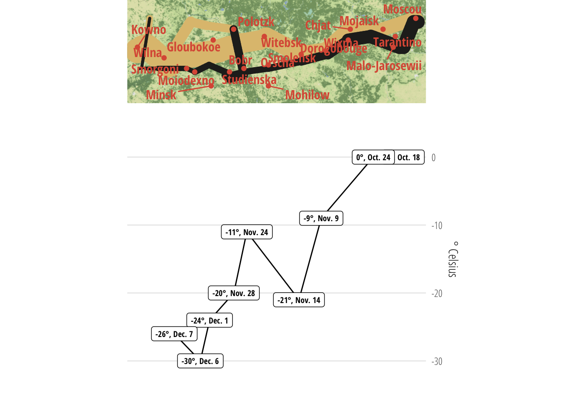

They're aligned, but there's an obvious problem—the map is way too small and the temperatures are too tall. With `grid.arrange` it's possible to pass a vector of relative panel heights, which would let us shrink the bottom panel. While using `gtable::rbind()` does let us align the two plots, it doesn't provide an easy way to mess with panel heights. Following [this StackOverflow answer](https://stackoverflow.com/questions/24331107/the-perils-of-aligning-plots-in-ggplot/24333504#24333504), though, we can mess with the ggplot object and adjust the panels manually.


```r
# Identify which layout elements are panels
panels <- both.1812.plot$layout$t[grep("panel", both.1812.plot$layout$name)]

# Normally we can pass a vector of null units that represent relative heights.
# For instance, `unit(c(3, 1), "null")` would make the top panel 3 times as
# tall as the bottom.

# But, the map here uses coord_equal() to show the correct dimensions of the
# map, and this messes with the panel height for whatever reason. So instead,
# we extract the original map panel height, which is really small, and then
# make the bottom panel smaller in the same scale.
map.panel.height <- both.1812.plot$heights[panels][1]

# See, super small
map.panel.height
```

```r
## [1] 0.345197879241894null
```

```r
# Apply new panel heights to object
both.1812.plot$heights[panels] <- unit(c(map.panel.height, 0.1), "null")

grid::grid.newpage()
grid::grid.draw(both.1812.plot)
```

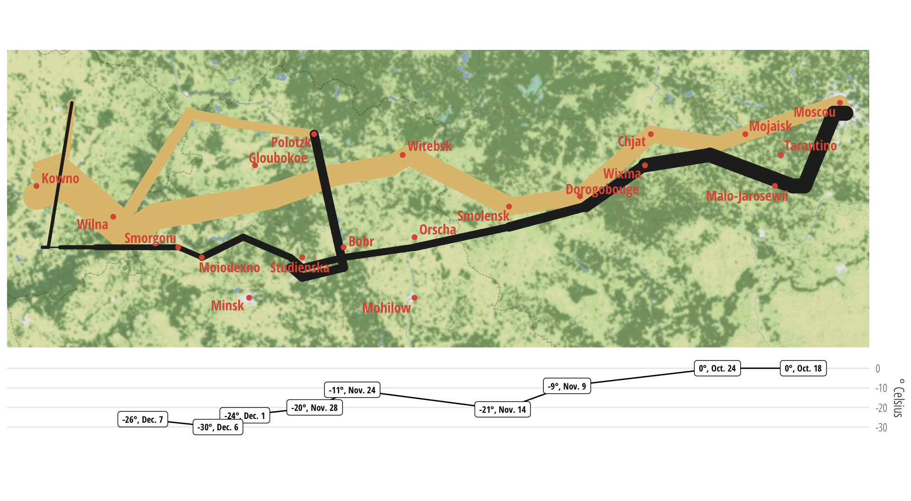

We can follow the same process to create a backgroundless version of the map:


```r
# No map this time
march.1812.plot.simple <- ggplot() +
  geom_path(data = troops, aes(x = long, y = lat, group = group,
                               color = direction, size = survivors),
            lineend = "round") +
  geom_point(data = cities, aes(x = long, y = lat),
             color = "#DC5B44") +
  geom_text_repel(data = cities, aes(x = long, y = lat, label = city),
                  color = "#DC5B44", family = "Open Sans Condensed Bold") +
  scale_size(range = c(0.5, 10)) +
  scale_colour_manual(values = c("#DFC17E", "#252523")) +
  guides(color = FALSE, size = FALSE) +
  theme_nothing()

# Change the x-axis limits to match the simple map
temps.1812.plot <- ggplot(data = temps.nice, aes(x = long, y = temp)) +
  geom_line() +
  geom_label(aes(label = nice.label),
            family = "Open Sans Condensed Bold", size = 2.5) +
  labs(x = NULL, y = "° Celsius") +
  scale_x_continuous(limits = ggplot_build(march.1812.plot.simple)$layout$panel_ranges[[1]]$x.range) +
  scale_y_continuous(position = "right") +
  coord_cartesian(ylim = c(-35, 5)) +  # Add some space above/below
  theme_bw(base_family = "Open Sans Condensed Light") +
  theme(panel.grid.major.x = element_blank(),
        panel.grid.minor.x = element_blank(),
        panel.grid.minor.y = element_blank(),
        axis.text.x = element_blank(), axis.ticks = element_blank(),
        panel.border = element_blank())

# Combine the two plots
both.1812.plot.simple <- rbind(ggplotGrob(march.1812.plot.simple),
                               ggplotGrob(temps.1812.plot))

# Adjust panels
panels <- both.1812.plot.simple$layout$t[grep("panel", both.1812.plot.simple$layout$name)]

# Because this plot doesn't use coord_equal, since it's not a map, we can use
# whatever relative numbers we want, like a 3:1 ratio
both.1812.plot.simple$heights[panels] <- unit(c(3, 1), "null")

grid::grid.newpage()
grid::grid.draw(both.1812.plot.simple)
```


## Conclusion

Recreating Minard's famous 1812 plot is relatively easy to do with ggplot. Adding fancy bells and whistles like maps and aligned panels is a little trickier, but the end result is worth the extra effort.
