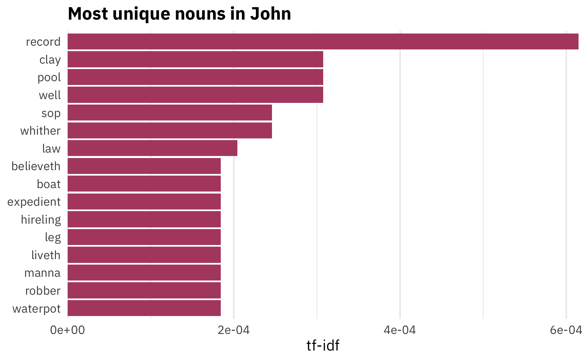
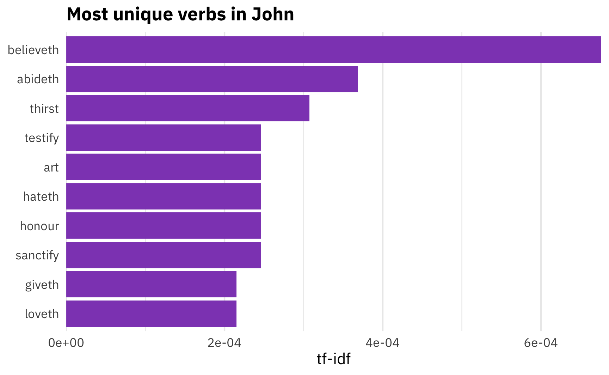
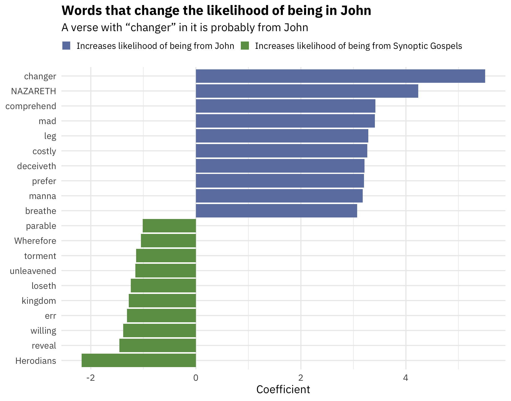

<span class="small">([See this notebook on GitHub](https://github.com/andrewheiss/tidytext-pos-john))</span>

---

As part of my goal to read some sort of religiously themed book every day ([what I’ve read so far](https://www.goodreads.com/review/list/2733632-andrew-heiss?shelf=religious)), I’ve been reading [Eric Huntsman’s new *Becoming the Beloved Disciple*](https://www.amazon.com/Becoming-Beloved-Disciple-Coming-Through/dp/1462136109/), a close reading of the Gospel of John from an LDS perspective.

Near the beginning, Huntsman discusses several word frequencies that make John unique compared to the [synoptic gospels](https://en.wikipedia.org/wiki/Synoptic_Gospels) of Matthew, Mark, and Luke (which all [draw on the same Q source](https://en.wikipedia.org/wiki/Q_source)). For instance, Huntsman states that John focuses more on themes of discipleship (since the word “disciple” appears 87 times in John), and on “knowing,” “believing,” and “doing,” which appear more often in John than the other gospels.

In the course of [teaching data visualization](https://datavizf18.classes.andrewheiss.com/class/11-class/), I’ve dabbled in text-based analysis with R, and as a PhD student I wrote a couple of [now-dormant papers](https://www.andrewheiss.com/research/heiss-rogerson-sources/) that used cool digital humanities methods to analyze large corpora of text, so my curiosity was piqued. How unique *is* the word “disciple” in John compared to the synoptic gospels? What are the most unique verbs in John? What words are the most predictive that we’re in John?

Let’s explore with R!

As I started writing this post, I also accidentally created an R package. The complete LDS scriptures are [available online for free as an open source database](http://scriptures.nephi.org/), and I’ve downloaded that CSV file so many times for other little mini projects I’ve done, so I decided to finally just stick it all in a new package so I wouldn’t need to keep downloading the data by hand. [So, behold: **scriptuRs**](https://github.com/andrewheiss/scriptuRs). Install it with `remotes::install_github("andrewheiss/scriptuRs")` or `devtools::install_github("andrewheiss/scriptuRs")`. It’ll be on CRAN once they open up for submissions again in January.

## Load packages and data

First, we'll load the necessary packages and data:


```r
library(tidyverse)  # For dplyr, ggplot2, and friends
library(scriptuRs)  # For full text of bible
library(tidytext)   # For analyzing text
library(cleanNLP)   # For fancier natural language processing

# Load data
gospels <- kjv_bible() %>% 
  filter(book_title %in% c("Matthew", "Mark", "Luke", "John"))
```


## Part-of-speech tagging

Because I want to know what the most unique/common verbs are in John, we need to identify the grammatical purpose of each word. There are incredible algorithms for tagging parts of speech, such as [Stanford NLP](https://nlp.stanford.edu/) or [spaCy](https://spacy.io/), and the [**cleanNLP** package](https://statsmaths.github.io/cleanNLP/) provides an easy frontend for working with any of them.

Installing **cleanNLP** is trivial—it’s just a normal R package—but connecting it with external NLP algorithms is a little trickier. To install spaCy, which is a really fast tagging library, follow these steps:

1.  Make sure Python is installed.

2.  Open Terminal and run this command to install spaCy:
    
    ```
    pip install -U spacy
    ```

3.  Run this command to download spaCy’s English algorithms:
    
    ```
    python -m spacy download en
    ```

Then, in RStudio, we can point R to the version of Python that has spaCy installed and tell **cleanNLP** to use spaCy as the NLP backend:


```r
# Set up NLP backend
reticulate::use_python("/usr/local/bin/python3")  # I use homebrew python3
cnlp_init_spacy()  # Use spaCy
# cnlp_init_udpipe()  # Or use this R-only one without external dependencies
```

With all that set up, we can now use `cnlp_annotate()` to do the actual tagging:


```r
# Determine the parts of speech of the "text" column and use "verse_title" as the id
gospels_annotated <- cnlp_annotate(gospels,
                                   text_name = "text", doc_name = "verse_title")
```


The resulting object is a large `annotation`, which is a custom class for **cleanNLP** that‘s not very usable with tidy analysis. Fortunately there's a data frame in the object in the `$token` slot:


```r
gospel_terms <- gospels_annotated$token
head(gospel_terms)
## # A tibble: 6 x 10
##   doc_id       sid   tid token     token_with_ws lemma     upos  xpos  tid_source relation
##   <chr>      <int> <int> <chr>     <chr>         <chr>     <chr> <chr>      <int> <chr>   
## 1 Matthew 1…     1     1 THE       "THE "        the       DET   DT             2 det     
## 2 Matthew 1…     1     2 book      "book "       book      NOUN  NN             0 root    
## 3 Matthew 1…     1     3 of        "of "         of        ADP   IN             2 prep    
## 4 Matthew 1…     1     4 the       "the "        the       DET   DT             5 det     
## 5 Matthew 1…     1     5 generati… "generation " generati… NOUN  NN             3 pobj    
## 6 Matthew 1…     1     6 of        "of "         of        ADP   IN             5 prep
```

I think this is amazing. There are columns for each word, its lemma (an uncapitalized, unconjugated base form of the word), and the part of speech. The `upos` column shows the universal part of speech code (like `NOUN`, `PROPN` (for proper nouns), `VERB`, etc.), and the `pos` column shows a more detailed part of speech code, based on the [Penn Treebank codes](https://www.ling.upenn.edu/courses/Fall_2003/ling001/penn_treebank_pos.html) (you can get tenses, plurals, types of adverbs, etc.).

# Most unique words

With the parts of speech tagged, we can now figure out what are the most unique words in John. To do this, we’ll calculate the term-frequency inverse-document-frequency (tf-idf) score for each word. This number is ultimately fairly meaningless in isolation, but it generally measures how unique a word is in a corpus of documents—it is the product of the term frequency and the inverse document frequency:

$$
\begin{aligned}
tf(\text{term}) &= \frac{n_{\text{term}}}{n_{\text{terms in document}}} \\
idf(\text{term}) &= \ln{\left(\frac{n_{\text{documents}}}{n_{\text{documents containing term}}}\right)} \\
tf\text{-}idf(\text{term}) &= tf(\text{term}) \times idf(\text{term})
\end{aligned}
$$

To calculate this, first we need to specify what document each of these words is in. We can kind of get at that now, since the `id` column of `gospel_terms` contains the book, chapter name, and verse number for each word (i.e. Matthew 1:1), but it'd be nice to have a column called `book_title`. We had that column in the original `gospels` data, but we lost it after we ran the parts of speech tagging. We'll create a smaller dataset with the chapter, book, and verse information, and then join that to our tagged data:


```r
gospels_lookup <- gospels %>% 
  select(verse_title, book_title, chapter_number, verse_number)

gospel_terms <- gospel_terms %>% 
  left_join(gospels_lookup, by = c("doc_id" = "verse_title"))

glimpse(gospel_terms)
## Rows: 98,555
## Columns: 13
## $ doc_id         <chr> "Matthew 1:1", "Matthew 1:1", "Matthew 1:1", "Matthew 1:1", "Mat…
## $ sid            <int> 1, 1, 1, 1, 1, 1, 1, 1, 1, 1, 1, 1, 1, 1, 1, 1, 1, 1, 1, 1, 1, 1…
## $ tid            <int> 1, 2, 3, 4, 5, 6, 7, 8, 9, 10, 11, 12, 13, 14, 15, 16, 17, 18, 1…
## $ token          <chr> "THE", "book", "of", "the", "generation", "of", "Jesus", "Christ…
## $ token_with_ws  <chr> "THE ", "book ", "of ", "the ", "generation ", "of ", "Jesus ", …
## $ lemma          <chr> "the", "book", "of", "the", "generation", "of", "Jesus", "Christ…
## $ upos           <chr> "DET", "NOUN", "ADP", "DET", "NOUN", "ADP", "PROPN", "PROPN", "P…
## $ xpos           <chr> "DT", "NN", "IN", "DT", "NN", "IN", "NNP", "NNP", ",", "DT", "NN…
## $ tid_source     <int> 2, 0, 2, 5, 3, 5, 8, 6, 8, 11, 8, 11, 12, 13, 16, 13, 16, 17, 2,…
## $ relation       <chr> "det", "root", "prep", "det", "pobj", "prep", "compound", "pobj"…
## $ book_title     <chr> "Matthew", "Matthew", "Matthew", "Matthew", "Matthew", "Matthew"…
## $ chapter_number <dbl> 1, 1, 1, 1, 1, 1, 1, 1, 1, 1, 1, 1, 1, 1, 1, 1, 1, 1, 1, 1, 1, 1…
## $ verse_number   <dbl> 1, 1, 1, 1, 1, 1, 1, 1, 1, 1, 1, 1, 1, 1, 1, 1, 1, 1, 1, 2, 2, 2…
```

Now, we can use the `bind_tf_idf()` function from **tidytext** to calculate the tf-idf for each lemma in each book:


```r
# Add the tf-idf for these words
gospel_tf_idf <- gospel_terms %>% 
  mutate(upos = ifelse(lemma == "abideth", "VERB", upos)) %>% 
  mutate(lemma_upos = paste0(lemma, "_", upos)) %>% 
  count(book_title, lemma_upos, sort = TRUE) %>% 
  bind_tf_idf(lemma_upos, book_title, n) %>% 
  separate(lemma_upos, into = c("lemma", "upos"), sep = "_") %>% 
  arrange(desc(tf_idf))
```

So, what are the most unique (i.e. the highest tf-idf) nouns in John?


```r
uniquest_nouns_in_john <- gospel_tf_idf %>% 
  filter(upos == "NOUN", book_title == "John") %>%
  mutate(rank = 1:n())

uniquest_nouns_in_john %>% 
  top_n(10, tf_idf) %>% 
  mutate(lemma = fct_inorder(lemma)) %>% 
  ggplot(aes(x = fct_rev(lemma), y = tf_idf)) + 
  geom_col(fill = "#b24b70") + 
  labs(x = NULL, y = "tf-idf",
       title = "Most unique nouns in John") +
  coord_flip() +
  scale_y_continuous(expand = c(0, 0)) +
  theme_minimal(base_family = "IBM Plex Sans") +
  theme(plot.title = element_text(face = "bold"),
        panel.grid.major.y = element_blank())
```



The most common nouns are words like "record," "clay," and "pool". "Disciple" isn't in the top 10. Nor does it even have a positive number! It appears 79 times, but it's the 244th most unique noun in John (out of 463 words!), which means it's not that uncommon compared to the other gospels:


```r
uniquest_nouns_in_john %>% 
  filter(lemma == "disciple") %>% 
  select(-tf, -idf)
## # A tibble: 1 x 6
##   book_title lemma    upos      n tf_idf  rank
##   <chr>      <chr>    <chr> <int>  <dbl> <int>
## 1 John       disciple NOUN     79      0   244
```

In fact, the other gospels all use it fairly frequently too. John does indeed use it the most, but just a tiny bit more than Matthew:


```r
gospel_tf_idf %>% 
  filter(lemma == "disciple", upos == "NOUN") %>% 
  select(-tf, -idf)
## # A tibble: 4 x 5
##   book_title lemma    upos      n tf_idf
##   <chr>      <chr>    <chr> <int>  <dbl>
## 1 John       disciple NOUN     79      0
## 2 Matthew    disciple NOUN     74      0
## 3 Mark       disciple NOUN     46      0
## 4 Luke       disciple NOUN     39      0
```

What about the verbs? What are the most distinctive verbs in John?


```r
uniquest_verbs_in_john <- gospel_tf_idf %>% 
  filter(upos == "VERB", book_title == "John") %>% 
  mutate(rank = 1:n())

uniquest_verbs_in_john %>% 
  top_n(10, tf_idf) %>% 
  mutate(lemma = fct_inorder(lemma)) %>% 
  ggplot(aes(x = fct_rev(lemma), y = tf_idf)) + 
  geom_col(fill = "#8f4bbf") + 
  labs(x = NULL, y = "tf-idf",
       title = "Most unique verbs in John") +
  coord_flip() +
  scale_y_continuous(expand = c(0, 0)) +
  theme_minimal(base_family = "IBM Plex Sans") +
  theme(plot.title = element_text(face = "bold"),
        panel.grid.major.y = element_blank())
```



Here Huntsman is on to something. He argues that the frequency of the word "abide" represents John's emphasis on bridging the gap between what we should *do* and what we should *be*. That is, "to abide" means staying with someone, or maintaining an ongoing relationship, but also persisting and remaining in a way of life. If John emphasizes discipleship, it makes sense that he'd emphasize the need to abide—or continue—in discipleship. And indeed, it is one of the most unique verbs in John. Neat.

## Most predictive words

Beyond just counting words and calculating tf-idf scores, we can use fancier statistical and machine learning techniques to discover which words are the most predictive of being from John. If we stumbled on a random New Testament verse, what words would tip us off that the verse might be from John? If "disciple" isn't that unique of a word for John, what words are?

To do this, we'll adapt a [cool new blog post by Julia Silge](https://juliasilge.com/blog/tidy-text-classification/) and use a logistic regression model with [LASSO regularization](https://en.wikipedia.org/wiki/Lasso_(statistics)) to categorize John vs. the synoptic gospels. LASSOing gives us a measure of variable importance and lets us see which words are most important for predicting if text comes from John or not.

Before running the model with [**glmnet**'s](https://web.stanford.edu/~hastie/glmnet/glmnet_alpha.html) `cv.glmnet()`, we have to restructure our tidy data into a sparse matrix. Following Julia's approach, we'll also split our data into a training set and a test set:


```r
library(rsample)

# Make this random split reproducible
set.seed(1234)

verses_split <- gospels %>% 
  select(id = verse_title) %>% 
  initial_split(prop = 3/4)

train_data <- training(verses_split)
test_data <- testing(verses_split)
```

Now we can make a spare matrix based on the training set:


```r
sparse_words <- gospel_terms %>%
  count(doc_id, lemma) %>%
  inner_join(train_data, by = c("doc_id" = "id")) %>%
  cast_sparse(doc_id, lemma, n)

dim(sparse_words)
## [1] 2835 2590
```

We have 2,835 rows and 2,590 columns to work with. Phew.

We need an outcome variable here, too, or a binary variable indicating if the verse is in John or one of the synoptic gospels.


```r
verses_books <- tibble(verse_title = rownames(sparse_words)) %>% 
  left_join(gospels %>% select(verse_title, book_title), by = "verse_title") %>% 
  mutate(book_type = ifelse(str_detect(book_title, "John"), "John", "Synoptic gospels")) %>% 
  mutate(is_john = book_type == "John")
```

We can finally run the model now with the `sparse_words` matrix and the binary `verses_books$is_john` variable:


```r
library(glmnet)
library(doMC)
registerDoMC(cores = parallel::detectCores())

model <- cv.glmnet(sparse_words, verses_books$is_john,
                   family = "binomial",
                   parallel = TRUE, keep = TRUE
)
```

We can then extract the coefficients that have the highest lambda within 1 standard error of the minimum ([`glmnet` goes through a sequence of possible lambda values for each iteration of the model](https://stats.stackexchange.com/a/77549/3025)—we want the one with the best, or where it's big, but still close to the minimum).


```r
library(glmnet)
library(broom)

coefs <- model$glmnet.fit %>%
  tidy() %>%
  filter(lambda == model$lambda.1se) %>% 
  filter(term != "(Intercept)")

top_coefs <- coefs %>% 
  group_by(estimate > 0) %>%
  top_n(10, abs(estimate)) %>%
  ungroup() %>% 
  arrange(desc(estimate)) %>% 
  mutate(term = fct_inorder(term)) %>% 
  mutate(prob_type = ifelse(estimate > 0, "Increases likelihood of being from John", 
                            "Increases likelihood of being from Synoptic Gospels"),
         prob_type = fct_inorder(prob_type))

top_coefs %>%
  ggplot(aes(x = fct_rev(term), y = estimate, fill = prob_type)) +
  geom_col() +
  scale_fill_manual(values = c("#6d80b0", "#6c9d53"), name = NULL) +
  labs(x = NULL, y = "Coefficient",
       title = "Words that change the likelihood of being in John",
       subtitle = "A verse with “changer” in it is probably from John") +
  theme_minimal(base_family = "IBM Plex Sans") +
  theme(plot.title = element_text(face = "bold"),
        legend.position = "top",
        legend.justification = "left",
        legend.box.margin = margin(l = -0.75, t = -0.25, unit = "lines"),
        legend.key.size = unit(0.65, "lines")) +
  coord_flip()
```



For whatever reason, "changer" is a very John-like word (even though [the incident of the money changers at the temple appears in all four gospels](https://en.wikipedia.org/wiki/Cleansing_of_the_Temple)), and nouns like "manna" and "leg" are also very John-like. Meanwhile, words like "parable" and "Herodians" seem to be more Synoptic-like.

Where do words like "abide" or "disciple" fit in this model?


```r
coefs %>% 
  filter(term %in% c("disciple", "abideth"))
## # A tibble: 2 x 5
##   term      step estimate  lambda dev.ratio
##   <chr>    <dbl>    <dbl>   <dbl>     <dbl>
## 1 disciple    29    0.582 0.00646     0.617
## 2 abideth     29    2.78  0.00646     0.617
```

The coefficient for "disciple" is positive, but not really that high—just ≈0.6—so it doesn't boost the likelihood that we're in John. "Abideth," though, has a fairly strong effect, just as we found with the tf-idf.

Neat!
