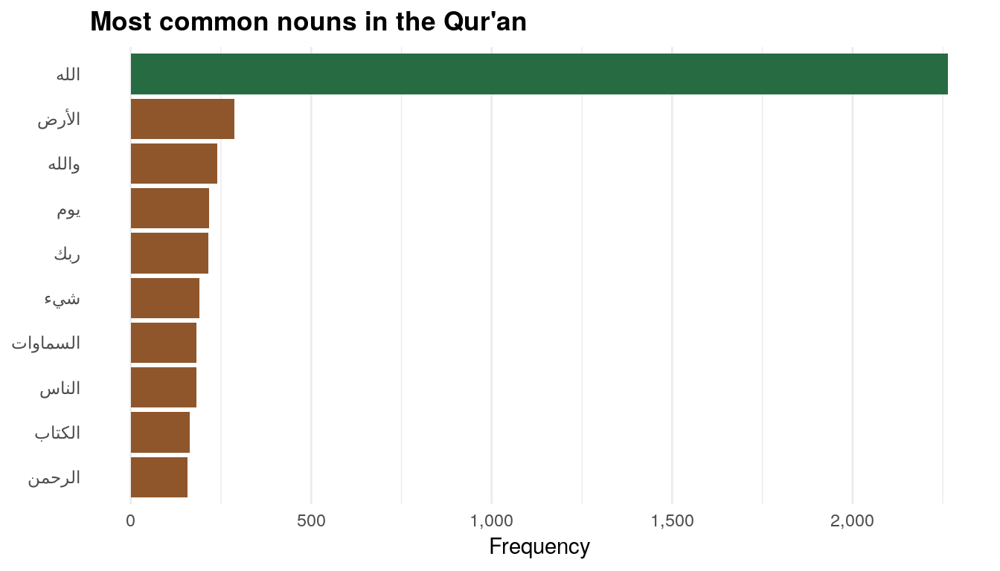
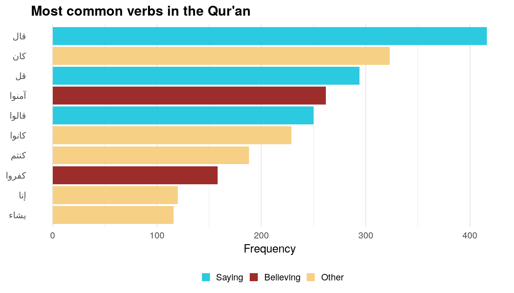
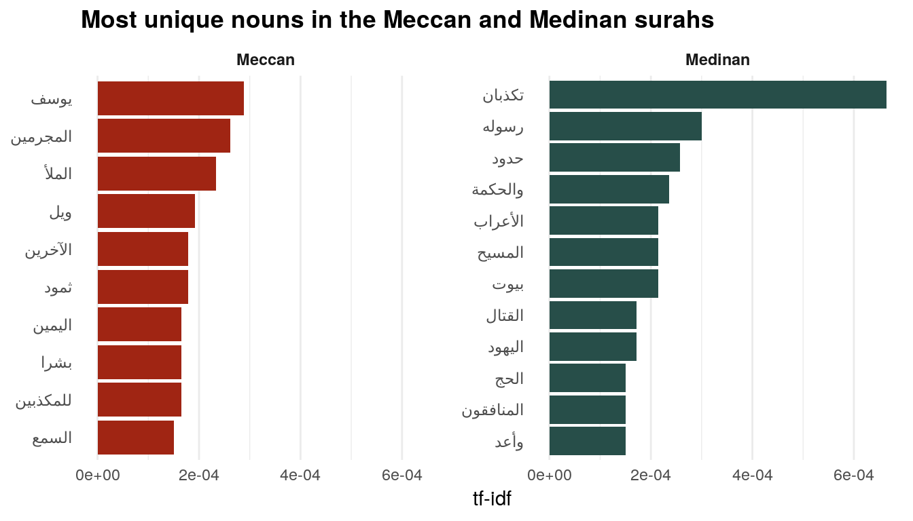

<span class="small">([See this notebook on GitHub](https://github.com/andrewheiss/tidytext-pos-arabic))</span>

---

As I showed in [a previous blog post](https://www.andrewheiss.com/blog/2018/12/26/tidytext-pos-john/), the [**cleanNLP** package](https://statsmaths.github.io/cleanNLP/) is a phenomenal frontend for natural language processing in R. Rather than learn the exact syntax for NLP packages like [spaCy](https://spacy.io/) or [CoreNLP](https://nlp.stanford.edu/), you can use a consistent set of functions and let **cleanNLP** handle the API translation behind the scenes for you.

Previously, I used spaCy to tag the parts of speech in the Four Gospels to find the most distinctive nouns and verbs in the Gospel of John. Here, I’ll show a quick example of how to use CoreNLP to tag parts of speech in Arabic. CoreNLP is far far far slower than spaCy, but it can handle languages like Arabic and Chinese, which is pretty magical.

Here we go!

## Load packages and data

You’ll need to install the [new **quRan** package](https://github.com/andrewheiss/quRan), which contains two Arabic versions of the Qur’an (with and without vowels) and two English translations (Yusuf Ali and Saheeh International). Install it with `remotes::install_github("andrewheiss/quRan")` or `devtools::install_github("andrewheiss/quRan")`. It’ll be on CRAN once they open up for submissions again in January.

You’ll also need to install **rJava**. [Best of luck with this.](https://twitter.com/andrewheiss/status/1078476157119418370?s=21) It is the worst package in the world to install, especially on macOS. The only way I got it to work was to [follow the instructions here](https://www.snaq.net/software/rjava-macos.php) (even though at the top of that page it says that recent versions of R/Java no longer require this fix—that is false). Here’s basically what you have to do:

- Download and install the [most recent Java SE 8 JDK from Oracle](http://www.oracle.com/technetwork/java/javase/downloads/index.html) (I did Java SE 8u191)
- Reinstall R
- Download and run the [`fix-rJava.sh` script](https://gist.github.com/gwinstanley/884d6af25844bdaeb0c81f95bb285768) listed at [snaq.net](https://www.snaq.net/software/rjava-macos.php)
- Install rJava with `install.packages("rJava")` or `install.packages("rJava", type = "source", repos = "http://cran.us.r-project.org")`
- Hopefully it worked?

Finally, you'll need to install `cleanNLP` and use it to download the CoreNLP parser and all its accompanying languages. Here’s how you do that:

``` r
library(cleanNLP)

# This should download everything
cnlp_download_corenlp()

# Check if Arabic is there
dir(system.file("extdata", package = "cleanNLP"))
```

Phew. If you’ve done all that, we can get started officially. We’ll load these packages:

``` r
library(tidyverse)
library(cleanNLP)
library(quRan)
library(tidytext)
library(arabicStemR)  # Has a list of Arabic stopwords
```

## Part-of-speech tagging

To start, we’ll initialize the CoreNLP Arabic tagging engine (this takes a few seconds to run):

``` r
cnlp_init_corenlp(language = "ar")
```

Then, for the sake of speed, we’ll extract just the first surah of the Qur’an ([the Fatihah](https://en.wikipedia.org/wiki/Al-Fatiha)) and tag it with `cnlp_annotate()`. We’ll use the version of the Qur’an without vowels because it seems to work better with CoreNLP. `cnlp_annotate()` does the heavy lifting of annotation and returns an object with the `annotate` class, which isn’t readily usable.

``` r
fatiha <- quran_ar_min %>% 
  filter(surah_id == 1)

fatiha_annotated <- cnlp_annotate(fatiha,
                                  text_name = "text", doc_name = "ayah_title")

fatiha_terms <- fatiha_annotated$token

head(fatiha_terms)

## # A tibble: 6 x 8
##   id      sid   tid word   lemma upos  pos     cid
##   <chr> <int> <int> <chr>  <chr> <chr> <chr> <int>
## 1 1:1       1     1 بسم    ""    NOUN  NNP       1
## 2 1:1       1     2 الله   ""    NOUN  NNP       5
## 3 1:1       1     3 الرحمن ""    ""    DTNNP    10
## 4 1:1       1     4 الرحيم ""    ""    DTNNP    17
## 5 1:2       1     1 الحمد  ""    ""    DTNNP     0
## 6 1:2       1     2 لله    ""    NOUN  NN        6
```

The output we get here isn’t as fancy as what spaCy returns for English text. We don’t get lemmatized words (base unpluralized, unconjugated words), and the `upos` column isn’t very rich—it just pulls out verbs and nouns. The `pos` column, though, seems to have more information in it. This column uses [codes from the Penn Treebank Project](https://www.ling.upenn.edu/courses/Fall_2003/ling001/penn_treebank_pos.html). For instance, “Allah” (الله) in the second row is marked as `NNP`, which is a singular proper noun, while “al-rahman” (the merciful; الرحمن) in the third row is marked as `DTNNP`, which is a determiner (`DT`; ال / “the”) + a singular proper noun (`NNP`; رحمن / “merciful”).

Now that we know the tagging works, we can tag the entire Qur’an. ***Warning:*** CoreNLP is *incredibly* slow with this much text. It took 2,194 seconds to run this on my newish MacBook Pro (36 minutes!). To speed this up, you can download and load the pre-tagged text:

- [`quran_annotated.rds`](quran_annotated.rds)

``` r
# THIS TAKES SO LONG
quran_annotated <- cnlp_annotate(quran_ar_min,
                                 text_name = "text", doc_name = "ayah_title")

# SAVE THIS SO YOU NEVER HAVE TO RUN IT AGAIN
saveRDS(quran_annotated, "quran_annotated.rds")
```

``` r
quran_annotated <- readRDS("data/quran_annotated.rds")

# Convert to data frame
quran_terms <- quran_annotated$token
```

## Most common nouns and verbs

Now that we have all the parts of speech for the Qur’an, we can do some quick exploratory data analysis.

For instance, what are the most common nouns in the book? We need to do a little fancy filtering for this to work because the `pos` column marks all sorts of nouns: singular proper nouns (`NNP`), plural proper nouns (`NNPS`), regular nouns with a “the” (`DTNN`), etc. We need to find all the words with `pos` that contains `NN`. The `str_detect()` function from **stringr** makes this easy.

Additionally, we need to remove common words like في and لهم. The **arabicStemR** package has a list of Arabic stopwords, but it’s buried in a `removeStopWords()` function. We can extract that list into its own mini data frame, though.

The [**stopwords** package](https://github.com/davnn/stopwords) also has a bunch of common Arabic words, accessible through `stopwords::stopwords(language = "ar", source = "misc"))`, but it’s not as long of a list as `arabicStemR::removeStopWords()`, and it includes important Qur’anic words like يوم (day). So we’ll just use the **arabicStemR** words here.

``` r
# In order to get the full list of Arabic stopwords, we have to feed
# removeStopWorsd some sort of Arabic text, and then access the
# `arabicStopwordList` from the resulting object. It's a roundabout approach,
# but it works
arabic_stopwords <- data_frame(word = removeStopWords("سلام")$arabicStopwordList)
```

(NOTE: It is currently not possible to correctly plot Arabic text (or any right-to-left text) in R on macOS, and [it’s been an issue for a long time](https://stackoverflow.com/questions/22423760/right-to-left-languages-support-in-r-using-mac). I made all these graphs with [the tidyverse Docker image](https://hub.docker.com/r/rocker/tidyverse/). You can also use `plotly::ggplotly()`)

``` r
top_nouns <- quran_terms %>% 
  filter(str_detect(pos, "NN")) %>% 
  count(word, sort = TRUE) %>% 
  # Get rid of tiny diacritic-like words
  filter(nchar(word) > 1) %>%
  # Get rid of stopwords
  anti_join(arabic_stopwords, by = "word") %>% 
  top_n(10, n) %>% 
  mutate(word = fct_inorder(word))

plot_top_nouns <- ggplot(top_nouns, aes(x = fct_rev(word), y = n, fill = n > 500)) +
  geom_col() + 
  scale_fill_manual(values = c("#8F562B", "#276B42"), guide = FALSE) +
  scale_y_continuous(labels = scales::comma) +
  labs(y = "Frequency", x = NULL) +
  coord_flip() +
  theme_minimal() +
  theme(panel.grid.major.y = element_blank())
plot_top_nouns
```



The most common noun *by far* is Allah, which makes sense, given that this is the Qur’an. The other common words are “earth,” “by Allah,” “day,” “your Lord,” “thing,” “heavens,” “people,” “book,” and “the Merciful.”

What about the most common verbs? Here we select words that have `VB` in their `pos`:

``` r
top_verbs <- quran_terms %>% 
  filter(str_detect(pos, "VB")) %>% 
  count(word, sort = TRUE) %>% 
  # Get rid of tiny diacritic-like words
  filter(nchar(word) > 1) %>%
  # Get rid of stopwords
  anti_join(arabic_stopwords, by = "word") %>% 
  top_n(10, n) %>% 
  mutate(word = fct_inorder(word))

word_themes <- data_frame(theme = c("Saying", "Other", "Saying", "Believing", 
                                    "Saying", "Other", "Other", "Believing", 
                                    "Other", "Other"))
top_verbs_themes <- top_verbs %>% 
  bind_cols(word_themes) %>% 
  mutate(theme = factor(theme, levels = c("Saying", "Believing", "Other")))

plot_top_verbs <- ggplot(top_verbs_themes, 
                         aes(x = fct_rev(word), y = n, fill = theme)) +
  geom_col() + 
  scale_fill_manual(values = c("#2BCAE0", "#9D2D2A", "#F5D085"),
                    name = NULL) +
  labs(y = "Frequency", x = NULL) +
  coord_flip() +
  theme_minimal() +
  theme(panel.grid.major.y = element_blank(),
        legend.position = "bottom",
        legend.key.size = unit(0.65, "lines"))
plot_top_verbs
```



Here, the most common verbs fall into two general themes: “saying” and “believing”. The most common “saying” words are literally “he said” and “said”, while the most common “believing” words are “y’all believe” (imperative) and “they disbelieve.” The other words are either forms of “to be” or preposition-like things that the tagger thought were verbs.

## Most distinctive Meccan and Medinan nouns

The Qur’an is a collection of revelations received by Mohammed in two different locations during two different time periods: [Mecca](https://en.wikipedia.org/wiki/Meccan_surah) and [Medina](https://en.wikipedia.org/wiki/Medinan_surah). Scholars have categorized the different surahs by their likely provenance, and the **quRan** package helpfully includes a column marking if each surah is Meccan or Medinan.

Typically, Meccan surahs are shorter than Medinan surahs and were revealed earlier during the development of Islam. As a check, lets see what the average surah length is across these two types of surahs:

``` r
period_length <- quran_ar_min %>% 
  group_by(revelation_type, surah_id) %>% 
  summarize(n_ayaat = n()) %>% 
  group_by(revelation_type) %>% 
  summarize(avg_ayaat = mean(n_ayaat))
period_length

## # A tibble: 2 x 2
##   revelation_type avg_ayaat
##   <chr>               <dbl>
## 1 Meccan               53.6
## 2 Medinan              58.0
```

Meccan surahs are an average of 4.5 ayahs shorter than Medinan surahs. Cool.

What are the most distinctive nouns and verbs in these two types of surahs? As in [my previous post about John and the synoptic gospels](https://www.andrewheiss.com/blog/2018/12/26/tidytext-pos-john/), we can use the [tf-idf score as a measure of word uniqueness](https://www.andrewheiss.com/blog/2018/12/26/tidytext-pos-john/#most-unique-words). The higher this value, the more unique a word is in a document in a corpus.

We lost lots of the helpful columns from `quran_ar_min` when tagging the parts of speech, though. All we’re left with from the original data is the `ayah_title` column, which gives the surah and ayah of each word (e.g. 2:242). To bring the revelation type and other columns back in, we’ll make a smaller dataset and then join that to our tagged data:

``` r
type_lookup <- quran_ar_min %>% 
  select(ayah_title, surah_id, surah_title_ar, surah_title_en, ayah, revelation_type)

quran_terms <- quran_terms %>% 
  left_join(type_lookup, by = c("id" = "ayah_title"))

glimpse(quran_terms)

## Observations: 82,823
## Variables: 13
## $ id              <chr> "1:1", "1:1", "1:1", "1:1", "1:2", "1:2", "1:2...
## $ sid             <int> 1, 1, 1, 1, 1, 1, 1, 1, 1, 1, 1, 1, 1, 1, 1, 1...
## $ tid             <int> 1, 2, 3, 4, 1, 2, 3, 4, 1, 2, 1, 2, 3, 1, 2, 3...
## $ word            <chr> "بسم", "الله", "الرحمن", "الرحيم", "الحمد", "ل...
## $ lemma           <chr> "", "", "", "", "", "", "", "", "", "", "", ""...
## $ upos            <chr> "NOUN", "NOUN", "", "", "", "NOUN", "NOUN", ""...
## $ pos             <chr> "NNP", "NNP", "DTNNP", "DTNNP", "DTNNP", "NN",...
## $ cid             <int> 1, 5, 10, 17, 0, 6, 10, 13, 0, 7, 0, 5, 9, 0, ...
## $ surah_id        <int> 1, 1, 1, 1, 1, 1, 1, 1, 1, 1, 1, 1, 1, 1, 1, 1...
## $ surah_title_ar  <fct> الفاتحة, الفاتحة, الفاتحة, الفاتحة, الفاتحة, ا...
## $ surah_title_en  <fct> Al-Faatiha, Al-Faatiha, Al-Faatiha, Al-Faatiha...
## $ ayah            <int> 1, 1, 1, 1, 2, 2, 2, 2, 3, 3, 4, 4, 4, 5, 5, 5...
## $ revelation_type <chr> "Meccan", "Meccan", "Meccan", "Meccan", "Mecca...
```

Now we can use the `bind_tf_idf()` function from **tidytext** to calculate the tf-idf for each word in each type of revelation:

``` r
type_tf_idf <- quran_terms %>% 
  count(revelation_type, word, pos, sort = TRUE) %>% 
  bind_tf_idf(word, revelation_type, n) %>% 
  arrange(desc(tf_idf))
```

Now we can find the uniquest nouns across the two types of surahs:

``` r
uniquest_nouns <- type_tf_idf %>% 
  # Only look at nouns
  filter(str_detect(pos, "NN")) %>% 
  group_by(revelation_type) %>% 
  top_n(10, tf_idf) %>% 
  ungroup() %>% 
  mutate(word = fct_inorder(word))

plot_unique_nouns <- ggplot(uniquest_nouns, 
                            aes(x = fct_rev(word), y = tf_idf, fill = revelation_type)) +
  geom_col() +
  scale_fill_manual(values = c("#A02513", "#274E49"), guide = FALSE) +
  labs(x = NULL, y = "tf-idf",
       title = "Most unique nouns in the Meccan and Medinan surahs") +
  coord_flip() +
  theme_minimal() +
  theme(plot.title = element_text(face = "bold"),
        strip.text = element_text(face = "bold"),
        panel.grid.major.y = element_blank()) +
  facet_wrap(~ revelation_type, scales = "free_y")
plot_unique_nouns
```



This is so cool. The most unique and distinctive Meccan nouns are “Joseph,” “criminals,” “filling,” “wo,” “others,” [“Thamoud,”](https://en.wikipedia.org/wiki/Thamud) “right,” “humans,” “liars,” and “hearing.” Most of these make sense: For instance, surah 12, “Yusuf”, is Meccan and is all about the story of Joseph in Egypt.

The most distinctive Medinan nouns, on the other hand, are “liars,” “his prophet,” “borders/limits,” “wisdom,” “Arabs,” “the Messiah,” “houses,” “killing/fighting,” “the Jews,” “the Hajj,” “hypocrites,” and “promised.”

We can also find the uniquest verbs—just use `filter(str_detect(pos, "VB"))` to select the verbs and do the same thing. I’ll leave that as an exercise to the reader.

Thus, we can do a lot of cool text analysis with Arabic using R!
