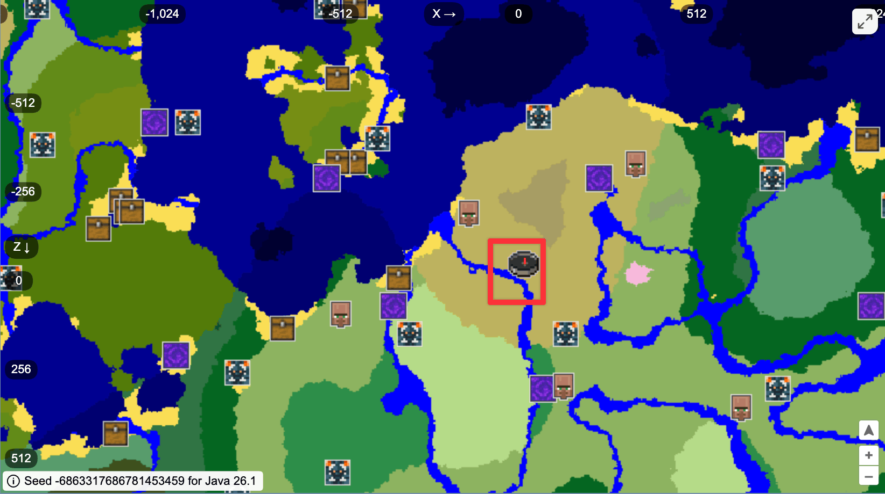

```{=html}
<script>
MathJax = {
  tex: {
    inlineMath: [['$', '$'], ['\\(', '\\)']]
  },
  svg: {
    fontCache: 'global'
  }
};
</script>
```

```{r}
#| label: setup
#| include: false

knitr::opts_chunk$set(
  fig.width = 6,
  fig.height = 6 * 0.618,
  fig.retina = 3,
  dev = "ragg_png",
  fig.align = "center",
  out.width = "90%",
  collapse = TRUE,
  cache.extra = 1234  # Change number to invalidate cache
)

options(
  digits = 4,
  width = 300,
  dplyr.summarise.inform = FALSE
)

# options(tinytable_html_mathjax = TRUE)
```

```{r}
#| warning: false
#| message: false

library(tidyverse)
library(tinytable)
library(scales)

clrs <- khroma::color("muted")(9)
clrs_trans <- alpha(clrs, 0.2)
clr_seed <- khroma::color("high contrast")(3)[2]
```

::: {.content-visible when-format="html"}
# Introduction {.hide}
:::

<div class="epigraph-wrapper clearfix">
  <figure class="w-75 float-end">
    <blockquote class="blockquote text-start">
      <p>“…as an ook cometh of a litel spyr…”</p>
    </blockquote>
    <figcaption class="blockquote-footer text-end">
      Geoffrey Chaucer (1343--1400),<br>*Troilus and Criseyde* [Book II, line 1335](http://www.librarius.com/troicris/trcr2bk1296-1351.htm).<br>In Chaucer's Middle English, a "spyr" is a seedling.
    </figcaption>
  </figure>
</div>

<div class="epigraph-wrapper clearfix">
  <figure class="w-75 float-end">
    <blockquote class="blockquote text-start">
      <p>Mighty oaks from little acorns grow.</p>
    </blockquote>
    <figcaption class="blockquote-footer text-end">
      Traditional English idiom, perhaps based on Chaucer.
    </figcaption>
  </figure>
</div>

If you've ever done anything involving randomness with statistical computing, you've likely come across the idea of a "seed." 

Let's say you make a plot like this to show distribution of the counts of different species of penguins across different islands:

```{r}
#| echo: true
#| out-width: 80%
#| fig-alt: |
#|   Scatter chart of penguin species on the x-axis and island on the y-axis,
#|   colored by island. Because over 300 observations are plotted without
#|   jitter, each species-island combination appears as a single dot. The
#|   chart shows that Torgersen Island has only Adélie penguins, Dream Island
#|   has Adélie and Chinstrap, and Biscoe Island has Adélie and Gentoo.

library(ggplot2)

ggplot(penguins, aes(x = species, y = island, color = island)) +
  geom_point() +
  guides(color = "none")
```

This plot is kind of helpful—it shows that Torgersen Island only has Adélie penguins, Dream Island has Adélies and Chinstraps, and Biscoe Island has Adélies and Gentoos. HOWEVER, there are actually 300+ points here that are all stacked on top of each other. We can jitter the points a little to see them:

```{r}
#| include: false
set.seed(12345)
```

```{r}
#| echo: true
#| out-width: 80%
#| fig-alt: |
#|   Scatter chart of penguin species on the x-axis and island on the y-axis,
#|   colored by island. Points are jittered randomly, revealing the spread of
#|   individual observations within each species-island combination. Because
#|   no seed is set, the exact jitter positions will differ each time the
#|   code runs.

ggplot(penguins, aes(x = species, y = island, color = island)) +
  geom_point(position = position_jitter()) +
  guides(color = "none")
```

If we make the plot again, the points will again be randomly shuffled, and it'll look slightly different, which can be annoying if you want to get the same consistent plot:

```{r}
#| echo: true
#| out-width: 80%
#| fig-alt: |
#|   Scatter chart of penguin species on the x-axis and island on the y-axis,
#|   colored by island. Points are jittered, but in a different arrangement
#|   than the previous plot because no seed is set, illustrating that
#|   unseeded jitter produces an inconsistent layout each time.

ggplot(penguins, aes(x = species, y = island, color = island)) +
  geom_point(position = position_jitter()) +
  guides(color = "none")
```

To make the points randomly shuffle *the same way every time*, we can set a seed:

```{r}
#| echo: true
#| out-width: 80%
#| fig-alt: |
#|   Scatter chart of penguin species on the x-axis and island on the y-axis,
#|   colored by island. Points are jittered using seed 1234, so the layout is
#|   identical every time the code runs, demonstrating that setting a seed
#|   produces a reproducible random arrangement.

ggplot(penguins, aes(x = species, y = island, color = island)) +
  geom_point(position = position_jitter(seed = 1234)) +
  guides(color = "none")
```

Now every time we run the code for that plot, it'll put those points in the same shuffled locations every time.

Seeds aren't just for plotting. If you've ever done things with Bayesian modeling or other types of simulation, you've also likely seen seeds. Modern Bayesian methods estimate posterior parameters with fancy Markov chain Monte Carlo (MCMC) simulations, which randomly walk through possible parameter values to figure out integrals. It's magical.^[See [chapter 7](https://www.bayesrulesbook.com/chapter-7) in *Bayes Rules!* [@JohnsonOttDogucu:2022] for the most intuitive explanation of MCMC I've come across.] To make MCMC chains take the same random walk on different computers, you can set a seed, and you'll get the same results every time. Like, run this {brms} regression model on your computer and you should get exactly the same values:

```{.r}
library(brms)
library(parameters)

model <- brm(
  bf(body_mass ~ flipper_len + species),
  data = penguins,
  family = gaussian(),
  backend = "cmdstanr",
  seed = 1234, refresh = 0
)

model_parameters(model, component = "location", verbose = FALSE)
#> Parameter        |   Median |               95% CI |     pd |  Rhat |  ESS
#> --------------------------------------------------------------------------
#> (Intercept)      | -4036.54 | [-5198.18, -2897.46] |   100% | 0.999 | 2318
#> flipper_len      |    40.73 | [   34.81,    46.92] |   100% | 0.999 | 2268
#> speciesChinstrap |  -207.92 | [ -326.51,   -90.19] |   100% | 1.000 | 2862
#> speciesGentoo    |   264.31 | [   77.93,   450.38] | 99.55% | 1.000 | 2229
```

Even non-statistical things use seeds. Every Minecraft world is [procedurally generated](https://99percentinvisible.org/episode/hl-05-press-b-to-touch-grass/) based on random numbers, and when you create a world, you have an option to specify a seed so that you can create specific random worlds. Later on, you can find the seed for a Minecraft world with the `/seed` command and recreate that exact world again using that seed. There's even [a whole subreddit](https://www.reddit.com/r/minecraftseeds/) dedicated to sharing weird and interesting things that get generated when using specific seeds. Since these random worlds are reproducible, there are sites like [Chunkbase](https://www.chunkbase.com/) that let you see the whole world map for any given seed.

For fun, I spun up Minecraft and created a new world. It happened to use the seed `-6863317686781453459`. I took a screenshot of my view right at the world spawn, and that exact spot is visible in Chunkbase's map:

::: {.panel-tabset}
### Minecraft spawn point

{fig-alt="First-person Minecraft screenshot at a world spawn point. The player stands near a river, looking across the water toward an island in a savannah biome."}

### Map from Chunkbase

[Here's the map](https://www.chunkbase.com/apps/seed-map#seed=-6863317686781453459&platform=java_26_1&dimension=overworld&x=-216&z=-99&zoom=0.592) for this seed. That compass is where I'm standing; I'm looking across that river at the area that's in the bottom left corner of that red rectangle.

{fig-alt="Chunkbase seed map showing the procedurally generated overworld for Minecraft seed -6863317686781453459. A compass icon marks the player's spawn location, and a red rectangle highlights the area visible in the in-game screenshot."}

:::

```{=html}
<hr class="dinkus">
```

I've been using and thinking about seeds for more than a decade, but I have no idea how they actually work. All I know is that setting a seed lets you get the same random numbers again. Somehow.

But I want to know why! Let's figure it out.


# Seeds and reproducible randomness

Put simply, a seed lets you generate random numbers  in a reproducible way. Any time you do something random in R—use a function like `sample()` or `rnorm()` or shuffle points in a plot with `position_jitter()` or move labels around with `geom_label_repel()`—it uses some sort of starting point to make up those numbers. If you set a seed, your jittered points will be jittered the same way every time you make the plot; your random simulation will be the same every time you run it. That's great for reproducibility and consistency. **Seeds create reproducible randomness.**

A seed is an arbitrary integer that R's internal random number generator (RNG) algorithm needs to initialize its number-generating process. If you don't set a seed yourself, R will make one for itself through a combination of (1) the current time on your computer and (2) the internal ID of the R process that your computer is running. Seeds can be any number you want. People choose things like 1, 1234, 12345, [42](https://en.wikipedia.org/wiki/Phrases_from_The_Hitchhiker%27s_Guide_to_the_Galaxy#The_Answer_to_the_Ultimate_Question_of_Life,_the_Universe,_and_Everything_is_42), [8675309](https://en.wikipedia.org/wiki/867-5309/Jenny), the date like 20260413, or whatever. (Though, we'll see later in this post that [limiting yourself to these super common seeds is actually bad](https://blog.genesmindsmachines.com/p/if-your-random-seed-is-42-i-will)!)

I'll talk about R throughout this post, but the same principle applies everywhere. Every computer-based process for generating random numbers has to start with some initial number or seed. Often you have the ability to set that seed yourself—Python, Julia, Stata, and even Minecraft give you control over the starting value. Often you can't set the seed. Excel has a `RAND()` function, but there's no way to set a seed ([though people try!](https://stackoverflow.com/questions/33161114/setting-seed-for-excel-random-number-generator)). Javascript does random things, but cannot set a seed ([though there are workarounds!](https://stackoverflow.com/questions/521295/seeding-the-random-number-generator-in-javascript)). Switch games like Mario Kart and the Zelda franchise all use randomness, but there's no way to set a seed (I'd guess there's some secret developer mode to do it for testing though). 


# My (somewhat incorrect) mental model of how seeds work

When I teach about seeds, I'll typically have everyone in the class run this to generate 5 **r**andom **unif**ormly distributed numbers:

```{r}
#| include: false
set.seed(777743)
```

```{r}
#| echo: true

runif(5)
```

I then ask if anyone got the same five numbers. Nobody ever has.

I then have them run this:

```{r}
#| echo: true

set.seed(1234)
runif(5)
```

Students are generally surprised to see that everyone gets the same five numbers every time. They all get the same thing because we set the seed to 1234, so the random number generation process all starts at the same point and ends up with the same values.

I then have students run this:

```{r}
#| echo: true

set.seed(1234)
runif(5)
runif(5)
```

They'll get the same 5 numbers as before, and then a different new set of 5 numbers. They all get the same new set of 5 numbers.

To explain why the second `runif()` produced different random numbers, I would talk about "rounds", which generally made sense to me conceptually. In my mind, it felt like R was kind of like bumping the seed up each time a random function was used. It almost like the first random function used `1234`, then the next time R did something random it used something analogous to `1234.1`, then `1234.2`, and so on. **I know that this is 100% wrong**, but that's roughly how I've imagined it—a stack of seed-like "rounds" that R works through every time it does something random:

```{r}
#| echo: true

set.seed(1234)
runif(5)  # This uses "round 1" of the seed. The seed is 1234
runif(5)  # This uses "round 2" of the seed. Pretend it's like the seed is 1234.1 (it's not!)
```

That also fits with this idea of resetting the "rounds" when resetting the seed:

```{r}
#| echo: true

set.seed(1234)
runif(5)  # This uses "round 1" of the seed at 1234

set.seed(1234)
runif(5)  # This uses "round 1" of the seed again because it was reset to 1234
```

But then a couple weeks ago when teaching about seeds again, I noticed something new that broke my mental model of how seeds actually work.

To show this, let's set the seed to 1234 and then create 5 random uniformly distributed numbers:

```{r}
#| echo: true

set.seed(1234)
runif(5)
```

Cool. That's all normal and expected. Let's reset the seed to 1234 and generate just 2 numbers:

```{r}
#| echo: true

set.seed(1234)
runif(2)
```

Those two are the same two numbers that appeared at the beginning of `runif(5)`. That also makes sense to me, since we're using "round 1" of the seed.

Let's make 3 more random numbers. In my mental version of how seeds work, this is a new random-related function, so it should start from a kinda-sorta different seed, or the "round 2" version of the seed:

```{r}
#| echo: true

runif(3)
```

It doesn't though! Those three numbers are the **same** as the numbers 3, 4, and 5 in `runif(5)`! Here's everything all at once:

```{r}
#| echo: true

set.seed(1234)
runif(5)

set.seed(1234)
runif(2)
runif(3)

# Or all in the same vector!
set.seed(1234)
c(runif(2), runif(3))
```

Using a second random-related function didn't bump up to a new kinda-sorta seed. R isn't generating a new set of random numbers each time it does something random. 

Instead, R is continuing to use a *single list* of random numbers. We showed 5 of them the first time, then reset the seed, then showed 2, and then showed the next 3. Every function that uses randomness basically moves a pointer or a cursor through the same list of random values. 

That's wild.

So where does this list come from? How does a single seed create one huge list of random values? Will it run out of random numbers? If I jitter a scatterplot with a million points (probably a bad idea), will that consume all the random values in the list and mess things up if I want to use `sample()` or `rnorm()` later?


# Making "random" numbers with an equation

Around the same time I discovered that `runif(5)` and `c(runif(2), runif(3))` did the same thing, I was reading/listening to the audiobook of *The Art of Uncertainty* [@Spiegelhalter:2025]. Spiegelhalter has a chapter on the uncertainty associated with randomness and he spends some time explaining how equations let you generate a deterministic set of pseudorandom (or random-looking) values. He walks through a basic algorithm for generating random numbers called the [linear congruential generator](https://en.wikipedia.org/wiki/Linear_congruential_generator), or LCG. I've always wondered how these magic RNG algorithms actually worked, and I had to take a break from doing the dishes to run to Wikipedia to look up exactly how to use this equation.

The basic LCG algorithm looks like this:

$$
X_{n + 1} = (a X_n + c) \mod m
$$

I'm going to change it a little bit from what Wikipedia has because I don't like thinking about calculating the *next* value of $X$ (or $X_{n+1}$) and instead want to think about calculating the current value of $X$ (or $X_n$). The only thing that's different here is that the subscripts are $n$ and $n-1$ instead of $n+1$ and $n$:

$$
X_{n} = (a X_{n - 1} + c) \mod m
$$

:::: {.callout-note title='What is that "mod" thing?' collapse="true"}
The only potentially unfamiliar thing in this formula is that "mod" operator. This represents a [*modulo* operation](https://en.wikipedia.org/wiki/Modulo). That might sound intimidating and weird, but in practice it's something you learned back in elementary school when you learned long division. 

For example, what's 17 ÷ 5? With long division, we can calculate that it's 3, with a remainder of 2:

$$
\require{enclose}
\begin{array}{l}
  \phantom{5 \enclose{longdiv}{0}} 3 \text{ R} 2 \\[-3pt]
  5 \enclose{longdiv}{\phantom{.}17} \\[-3pt]
  \phantom{0}\underline{-15} \\[-3pt]
  \phantom{-11}2
\end{array}
$$

**That remainder is the result of the modulus operator.** That's it. "17 mod 5" is 2, since 17 divided by 5 is 3 with a remainder of 2.

What about "19 mod 3"? That's the remainder from 19 ÷ 3, or 1:

$$
\begin{array}{l}
  \phantom{5 \enclose{longdiv}{0}} 6 \text{ R} 1 \\[-3pt]
  3 \enclose{longdiv}{\phantom{.}19} \\[-3pt]
  \phantom{0}\underline{-18} \\[-3pt]
  \phantom{-11}1
\end{array}
$$

We can calculate the modulus directly in R with the `%%` mod operator:

```{r}
#| echo: true

17 %% 5
19 %% 3
```

Python uses a single `%`:

```{.python}
17 % 5
## 2
19 % 3
## 1
```

So if $m$ in the LCG algorithm is 5, we need to calculate the remainder when dividing by 5. If we have to do something like 24 mod 5, that's 24 ÷ 5, or 4 remainder 4. 

24 mod 5 = 4:

```{r}
24 %% 5
```

::: {.callout-tip title="Fun unrelated side note: Odd and even numbers" collapse="true"}

The mod operator is a super common way to determine if a number is even or odd. If a number is even, it should have no remainder when you divide it by 2. 24 mod 2 should be 0:

```{r}
24 %% 2
```

If there's a remainder when dividing by 2, it means that the number is not even. 25 mod 2 is 1 (since 25 ÷ 2 = 12 remainder 1)

```{r}
25 %% 2
```

You can use this mod operator to make your own function for checking if a number is even/odd:

```{r}
is_even <- function(x) {
  if (x %% 2 == 0) {
    "Yep! The number is even!"
  } else {
    "Nope! The number is odd!"
  }
}

is_even(17)
is_even(2)
```

:::

\ 

::::

This algorithm generates a sequence of $n$ pseudorandom numbers based on a few different inputs:

- $m$, or the modulus. This should be bigger than 0, or more formally, $0 \lt m$.
- $a$, or the multiplier. This should be bigger than 0 and generally be smaller than $m$, or $0 \lt a \lt m$.
- $c$, or the increment. This should be bigger or equal to 0 and generally be smaller than $m$, or $0 \leq c \lt m$.
- $X_{n - 1}$, or the previous pseudorandom value in the sequence.

Plug four numbers into the equation and you'll get a pseudorandom number. Plug *that* number back into the equation and you'll get a new pseudorandom number. Easy peasy.

You can generally use whatever numbers you want for $m$, $a$, and $c$, but notice how you need to use the previous value from the sequence ($X_{n - 1}$) to generate a new value ($X_n$). That's fine if you're in the middle of a sequence, but if you're at the beginning and want to generate $X_1$, there is no previous value at $X_0$. You need to provide your own. **This is the seed.** The seed is the initial value for the algorithm that generates the rest of the sequence of pseudorandom numbers.

Let's make some random numbers one step at a time to illustrate how this works. We'll arbitrarily set some values for $m$, $a$, and $c$, and we'll use a seed (or $X_0$) of 1.

```{r}
#| echo: false

a <- 5
c <- 3
m <- 8
x0 <- 1

tribble(
  ~Parameter   , ~` `    , ~Value ,
  "Modulus"    , "$m$"   , m      ,
  "Multiplier" , "$a$"   , a      ,
  "Increment"  , "$c$"   , c      ,
  "Seed"       , "$X_0$" , x0
) |> 
  tt() |> 
  style_tt(align = "lcc")
```

To generate the first number in the sequence, we'll plug in all those values:

$$
\begin{aligned}
X_{1} &= (a X_{0} + c) \mod m \\
&= (5 × \mathbf{1} + 3) \mod 8 \\
&= 8 \mod 8 \\
&= 0 \\
\end{aligned}
$$

Our first "random" number $X_1$ is 0. Neat!

To make the next one in the sequence, we'll use that 0 for $X_{n - 1}$:

$$
\begin{aligned}
X_{2} &= (a X_{1} + c) \mod m \\
&= (5 × \mathbf{0} + 3) \mod 8 \\
&= 3 \mod 8 \\
&= 3 \\
\end{aligned}
$$

The second number in the sequence is 3. Let's do one more step to get $X_3$:

$$
\begin{aligned}
X_{3} &= (a X_{2} + c) \mod m \\
&= (5 × \mathbf{3} + 3) \mod 8 \\
&= 18 \mod 8 \\
&= 2 \\
\end{aligned}
$$

$X_3$ is 2.

So far, our sequence of pseudorandom numbers looks like this:

$$
X = \{0, 3, 2\}
$$

The LCG algorithm produces a pseudorandom uniform distribution of integers. We can scale these down to a range between 0 and 1 by dividing by $m$:^[This works because we'll never actually have any random number higher than $m - 1$. When dividing by 8, we'll never have a remainder of 8 or 9 or anything, and 7 will be the biggest possible remainder.]

$$
\begin{aligned}
X &= \{0, 3, 2\} \\
X / 8 &= \{0, 0.375, 0.25\}
\end{aligned}
$$

Instead of doing this slowly step by step, here's a table showing the sequence:

:::: {#tbl-lcg-8 layout="[[4,8]]"}

```{r}
a <- 5
c <- 3
m <- 8
x0 <- 1

tribble(
  ~Parameter   , ~` `    , ~Value ,
  "Modulus"    , "$m$"   , m      ,
  "Multiplier" , "$a$"   , a      ,
  "Increment"  , "$c$"   , c      ,
  "Seed"       , "$X_0$" , x0
) |> 
  tt() |> 
  style_tt(align = "lcc") |> 
  style_tt(j = 3, i = 4, background = clr_seed, bold = TRUE)
```

```{r}
n <- 11

out <- tibble(iteration = 1:(n + 1)) |>
  mutate(
    # y is the index for the vector and it's not actualy used here
    x_nm1 = accumulate(1:n, \(x, y) ((a * x) + c) %% m, .init = x0),
    ax_nm1_c = (a * x_nm1) + c,
    mod_m = ax_nm1_c %% m,
    x_over_m = mod_m / m
  )

lcg_8_values <- out |> select(mod_m, x_over_m)

out |>
  mutate(iteration = str_glue("$X_{{{iteration}}}$")) |> 
  select(
    ` ` = iteration,
    `$X_{n - 1}$` = x_nm1,
    `$(a X_{n - 1} + c)$` = ax_nm1_c,
    `… mod $m$` = mod_m,
    `$X_n / m$` = x_over_m
  ) |> 
    tt() |> 
    style_tt(align = "c") |> 
    style_tt(j = 2, i = 1, background = clr_seed, bold = TRUE) |> 
    style_tt(j = 2, i = seq(2, n + 1, 3), background = clrs_trans[1]) |> 
    style_tt(j = 4, i = seq(1, n + 1, 3), background = clrs_trans[1]) |> 
    style_tt(j = 2, i = seq(3, n + 1, 3), background = clrs_trans[3]) |> 
    style_tt(j = 4, i = seq(2, n + 1, 3), background = clrs_trans[3]) |> 
    style_tt(j = 2, i = seq(4, n + 1, 3), background = clrs_trans[5]) |> 
    style_tt(j = 4, i = seq(3, n + 1, 3), background = clrs_trans[5]) |> 
    group_tt(j = list("The “random” number!" = 4:5))
```

Twelve pseudorandom numbers generated with the LCG algorithm: $X_{n} = (5 X_{0} + 3) \mod 8$ with a seed ($X_0$) of 1

::::

We successfully created a sequence of pseudorandom numbers!

Since this series of numbers is uniformly distributed, we can pick numbers from the list to generate sets of random numbers. Let's pretend we have our own function named `simple_runif()` that mimics R's `runif()` but draws from this table that we just made.

If we want 5 random numbers from a uniform distribution, we can take the first 5 $X$ values:

$$
\texttt{simple\_runif(5)} = X_{1, 2, 3, 4, 5} = \{`{r} I(paste0(round(out$x_over_m[1:5], 3), collapse = ", "))`\}
$$

If we wanted another set of 5 random numbers, we'd get the next 5:

$$
\texttt{simple\_runif(5)} = X_{6, 7, 8, 9, 10} =  = \{`{r} I(paste0(round(out$x_over_m[6:10], 3), collapse = ", "))`\}
$$

If we set the seed back to 1 with an imaginary function like `simple_set.seed(1)` and then generate 2 random numbers, and then three random numbers (like I did earlier with the real `runif(2)` and `runif(3)`), we'd go back to the beginning of the series of numbers and get these:

$$
\begin{aligned}
&\texttt{simple\_set.seed(1)} \\
&\texttt{simple\_runif(2)} = X_{1, 2} = \{`{r} I(paste0(round(out$x_over_m[1:2], 3), collapse = ", "))`\} \\
&\texttt{simple\_runif(3)} = X_{3, 4, 5} = \{`{r} I(paste0(round(out$x_over_m[3:5], 3), collapse = ", "))`\}
\end{aligned}
$$

We can adjust any of the $a$ and $c$ parameters, the modulus $m$, or the starting seed $X_0$ to get a different set of numbers:

::::: {.panel-tabset}

### a = 5, c = 3, m = 8, seed = 1234

:::: {.grid}

::: {.g-col-4}

```{r}
a <- 5
c <- 3
m <- 8
x0 <- 1234

tribble(
  ~Parameter   , ~` `    , ~Value ,
  "Modulus"    , "$m$"   , m      ,
  "Multiplier" , "$a$"   , a      ,
  "Increment"  , "$c$"   , c      ,
  "Seed"       , "$X_0$" , x0
) |> 
  tt() |> 
  style_tt(align = "lcc") |> 
  style_tt(j = 3, i = 4, background = clr_seed, bold = TRUE)
```

:::

::: {.g-col-8}

```{r}
n <- 11

tibble(iteration = 1:(n + 1)) |>
  mutate(
    x_nm1 = accumulate(1:n, \(x, y) ((a * x) + c) %% m, .init = x0),
    ax_nm1_c = (a * x_nm1) + c,
    mod_m = ax_nm1_c %% m,
    x_over_m = mod_m / m
  ) |>
  mutate(iteration = str_glue("$X_{{{iteration}}}$")) |> 
  select(
    ` ` = iteration,
    `$X_{n - 1}$` = x_nm1,
    `$(a X_{n - 1} + c)$` = ax_nm1_c,
    `… mod $m$` = mod_m,
    `$X_n / m$` = x_over_m
  ) |> 
    tt() |> 
    style_tt(align = "c") |> 
    style_tt(j = 2, i = 1, background = clr_seed, bold = TRUE) |> 
    style_tt(j = 2, i = seq(2, n + 1, 3), background = clrs_trans[1]) |> 
    style_tt(j = 4, i = seq(1, n + 1, 3), background = clrs_trans[1]) |> 
    style_tt(j = 2, i = seq(3, n + 1, 3), background = clrs_trans[3]) |> 
    style_tt(j = 4, i = seq(2, n + 1, 3), background = clrs_trans[3]) |> 
    style_tt(j = 2, i = seq(4, n + 1, 3), background = clrs_trans[5]) |> 
    style_tt(j = 4, i = seq(3, n + 1, 3), background = clrs_trans[5]) |> 
    group_tt(j = list("The “random” number!" = 4:5))
```

:::

::::

### a = 11, c = 4, m = 23, seed = 10

:::: {.grid}

::: {.g-col-4}

```{r}
a <- 11
c <- 4
m <- 23
x0 <- 10

tribble(
  ~Parameter   , ~` `    , ~Value ,
  "Modulus"    , "$m$"   , m      ,
  "Multiplier" , "$a$"   , a      ,
  "Increment"  , "$c$"   , c      ,
  "Seed"       , "$X_0$" , x0
) |> 
  tt() |> 
  style_tt(align = "lcc") |> 
  style_tt(j = 3, i = 4, background = clr_seed, bold = TRUE)
```

:::

::: {.g-col-8}

```{r}
n <- 11

tibble(iteration = 1:(n + 1)) |>
  mutate(
    x_nm1 = accumulate(1:n, \(x, y) ((a * x) + c) %% m, .init = x0),
    ax_nm1_c = (a * x_nm1) + c,
    mod_m = ax_nm1_c %% m,
    x_over_m = mod_m / m
  ) |>
  mutate(iteration = str_glue("$X_{{{iteration}}}$")) |> 
  select(
    ` ` = iteration,
    `$X_{n - 1}$` = x_nm1,
    `$(a X_{n - 1} + c)$` = ax_nm1_c,
    `… mod $m$` = mod_m,
    `$X_n / m$` = x_over_m
  ) |> 
    tt() |> 
    style_tt(align = "c") |> 
    style_tt(j = 2, i = 1, background = clr_seed, bold = TRUE) |> 
    style_tt(j = 2, i = seq(2, n + 1, 3), background = clrs_trans[1]) |> 
    style_tt(j = 4, i = seq(1, n + 1, 3), background = clrs_trans[1]) |> 
    style_tt(j = 2, i = seq(3, n + 1, 3), background = clrs_trans[3]) |> 
    style_tt(j = 4, i = seq(2, n + 1, 3), background = clrs_trans[3]) |> 
    style_tt(j = 2, i = seq(4, n + 1, 3), background = clrs_trans[5]) |> 
    style_tt(j = 4, i = seq(3, n + 1, 3), background = clrs_trans[5]) |> 
    group_tt(j = list("The “random” number!" = 4:5))
```

:::

::::

### a = 54, c = 17, m = 57, seed = 42

:::: {.grid}

::: {.g-col-4}

```{r}
a <- 54
c <- 17
m <- 57
x0 <- 42

tribble(
  ~Parameter   , ~` `    , ~Value ,
  "Modulus"    , "$m$"   , m      ,
  "Multiplier" , "$a$"   , a      ,
  "Increment"  , "$c$"   , c      ,
  "Seed"       , "$X_0$" , x0
) |> 
  tt() |> 
  style_tt(align = "lcc") |> 
  style_tt(j = 3, i = 4, background = clr_seed, bold = TRUE)
```

:::

::: {.g-col-8}

```{r}
n <- 11

tibble(iteration = 1:(n + 1)) |>
  mutate(
    x_nm1 = accumulate(1:n, \(x, y) ((a * x) + c) %% m, .init = x0),
    ax_nm1_c = (a * x_nm1) + c,
    mod_m = ax_nm1_c %% m,
    x_over_m = mod_m / m
  ) |>
  mutate(iteration = str_glue("$X_{{{iteration}}}$")) |> 
  select(
    ` ` = iteration,
    `$X_{n - 1}$` = x_nm1,
    `$(a X_{n - 1} + c)$` = ax_nm1_c,
    `… mod $m$` = mod_m,
    `$X_n / m$` = x_over_m
  ) |> 
    tt() |> 
    style_tt(align = "c") |> 
    style_tt(j = 2, i = 1, background = clr_seed, bold = TRUE) |> 
    style_tt(j = 2, i = seq(2, n + 1, 3), background = clrs_trans[1]) |> 
    style_tt(j = 4, i = seq(1, n + 1, 3), background = clrs_trans[1]) |> 
    style_tt(j = 2, i = seq(3, n + 1, 3), background = clrs_trans[3]) |> 
    style_tt(j = 4, i = seq(2, n + 1, 3), background = clrs_trans[3]) |> 
    style_tt(j = 2, i = seq(4, n + 1, 3), background = clrs_trans[5]) |> 
    style_tt(j = 4, i = seq(3, n + 1, 3), background = clrs_trans[5]) |> 
    group_tt(j = list("The “random” number!" = 4:5))
```

:::

::::

:::::


## Live interactive playground

To help with the intuition behind all these moving parts, I find that it's really useful to play with a live, interactive version of the LCG algorithm. When I cover this in class, I use Excel to build a notebook with adjustable parameters. You can download your own Excel simulation:

::: {.text-center}
[&ensp;seed-playground.xlsx](seed-playground.xlsx){.btn .btn-primary .mb-1 target="_blank"}
:::

Here's an interactive in-browser OJS-based version of the same thing. Adjust $m$, $a$, $c$, $X_0$, and $n$ to see how parameters like $a$ and $c$ influence the calculations, how $m$ determines the length of a period, and how the seed $X_0$ leads to different series of pseudorandom numbers.

$$
X_{n} = (a X_{n - 1} + c) \mod m
$$

```{ojs}
//| panel: sidebar

viewof m = Inputs.range([2, 500], {value: 8, step: 1, label: htl.html`Modulus (<i>m</i>)`})
viewof a = Inputs.range([1, 20], {value: 5, step: 1, label: htl.html`Multiplier (<i>a</i>)`})
viewof c = Inputs.range([0, 20], {value: 3, step: 1, label: htl.html`Increment (<i>c</i>)`})
viewof seed = Inputs.range([0, 2000], {value: 1, step: 1, label: htl.html`Seed (<i>X</i><sub>0</sub>)`})
viewof n = Inputs.range([1, 50], {value: 12, step: 1, label: htl.html`<br><br>Numbers to generate`})
```

```{ojs}
//| panel: fill

lcg_data = {
  let rows = [];
  let x = seed;
  for (let i = 1; i <= n; i++) {
    const ax_c = a * x + c;
    const mod = ax_c % m;
    rows.push({
      n: i,
      x_prev: x,
      ax_plus_c: ax_c,
      mod_m: mod,
      x_over_m: mod / m
    });
    x = mod;
  }
  return rows;
}

htl.html`<table id="simulation-table">
  <thead>
    <tr>
      <th></th>
      <th></th>
      <th></th>
      <th colspan="2" style="text-align: center; border-bottom: 1px solid #000000;">The "random" number!</th>
    </tr>
    <tr>
      <th></th>
      <th><i>X</i><sub>n−1</sub></th>
      <th>(<i>a</i><i>X</i><sub>n−1</sub> + <i>c</i>)</th>
      <th>… mod <i>m</i></th>
      <th><i>X</i><sub>n</sub> / <i>m</i></th>
    </tr>
  </thead>
  <tbody>
    ${lcg_data.map((row, i) => {
      const colors = ["#CC66774C", "#DDCC774C", "#88CCEE4C"];
      const cur = colors[i % 3];
      const prev = colors[(i + 2) % 3];
      return htl.html`<tr>
        <td><i>X</i><sub>${row.n}</sub></td>
        <td style="background: ${i === 0 ? '#DDAA33' : prev}; font-weight: ${i === 0 ? 'bold' : 'normal'}">${row.x_prev}</td>
        <td>${row.ax_plus_c}</td>
        <td style="background: ${cur}">${row.mod_m}</td>
        <td>${row.x_over_m.toFixed(3)}</td>
      </tr>`;
    })}
  </tbody>
</table>`
```

## Cycles and fancier algorithms

Look back at @tbl-lcg-8 where we we used *m* = 8, *a* = 5, *c* = 3, and a seed of 1. Something peculiar happens at the 9th number:

```{r}
lcg_8_values |>
  t() |>
  as_tibble(rownames = "value", .name_repair = "unique_quiet") |>
  mutate(value = case_match(
    value,
    "mod_m" ~ "$X_n$",
    "x_over_m" ~ "$X_{n} / m$"
  )) |> 
  setNames(c(" ", paste0("$X_{", 1:(nrow(lcg_8_values)), "}$"))) |>
  tt() |> 
  format_tt(i = 1, digits = 1) |> 
  format_tt(i = 2, sprintf = "%.3f") |> 
  style_tt(align = "c", fontsize = 0.9) |> 
  style_tt(j = c(2, 10), i = 1:2, background = alpha(clrs[9], 0.5)) |> 
  style_tt(j = c(3, 11), i = 1:2, background = alpha(clrs[9], 0.3)) |> 
  style_tt(j = c(4, 12), i = 1:2, background = alpha(clrs[9], 0.1))
```

It starts over! $X_1$ and $X_9$ are the same; $X_2$ and $X_{10}$ are the same; and so on. We have a repeating cycle and our series of pseudorandom numbers gets recycled.

This happens because of a severe limitation in the LCG algorithm—cycles, or periods, are inevitable and are related to the size of the modulus parameter $m$. Since we're dividing by 8 and getting the remainder, we only have the numbers 0--7 to work with for each subsequent number, and eventually we'll run out and get into a cycle. We can somewhat avoid this by boosting the $m$. If we increase the modulus to something like 500 (try it in the interactive simulation up above), we'll have remainders like 403, 291, and so on. That many unique possibilities will make the period last longer, but eventually it will recycle.

So to *actually* get around this, no statistical or computational software really uses LCG.^[Though, surprisingly, Java used an LCG [up until 2020](https://en.wikipedia.org/wiki/Pseudorandom_number_generator#Potential_issues)(!). It only switched to something more complex with Java 17.] Instead, they use much fancier techniques with more complex algorithms that prevent cycling. Fundamentally all these algorithms do the same thing—they start with a seed number, do some math to it, and spit out a random number that is then used to create the next number in the sequence. They just do it with really fancy math.

For instance, by default R uses an algorithm called the [Mersenne Twister](https://en.wikipedia.org/wiki/Mersenne_Twister)—which was only invented in 1997! [@MatsumotoNishimura:1998]—that takes a dozen+ parameters and uses a special seed that is actually a vector with 624 elements in it (!). See Danielle Navarro's [fascinating post about this here](https://blog.djnavarro.net/posts/2023-12-27_seedcatcher/#on-the-particulars-of-the-r-approach), where she looks into the guts of R's random number generation system, including some of the individual pieces of the vector-based seed.

The Mersenne Twister algorithm *will* eventually recycle and restart its random numbers for a given seed, but its period length is massive: 2^19937^ − 1. That number has 6,002 digits, like 10^6002^, but instead of all 0s like 10^6002^, it's a prime number. [You can actually see all the digits here.](https://t5k.org/primes/page.php?id=22882) Claus Wilke calls this period length "an unimaginably large number" and [his description of what that actually means](https://blog.genesmindsmachines.com/i/175157766/what-is-a-random-seed) is poetic:

> To give you a sense of how large it is, for comparison, there are approximately 10^80^ atoms in the universe. This is tiny compared to 10^6000^. The period of the Mersenne twister has space for entire universes for every single atom in the universe, and then some. In fact, you could create an entire universe for every atom, and then create another entire universe for every atom in every of the universes you have created, and keep nesting 75 times, and still you wouldn’t run out of room in the period of the Mersenne twister. If you used the Mersenne twister to create nested universes 75 times deep, all these universes inside universes inside other universes would be different from each other.

So unless you're creating deeply nested *universes*, in practice you'll never recycle the numbers that are generated from a single seed based on the Mersenne Twister algorithm.

Again, even though the Mersenne Twister (and whatever other fancy algorithms other languages and programs use) is complex, the intuition from the LCG remains the same: generate a big long list of pseudorandom numbers by starting with an initial value—or a seed—and then plugging each subsequent random number into an equation to make more.


# Why does it matter if "random" numbers aren't actually random?

I've long known that random computer generated numbers aren't officially random, but with my wrong idea of R setting a kinda-sorta seed each time it uses a new function, it still felt fairly random-ish, since I figured that new sets of numbers would get generated. 

But that's not the case at all!

When you do something like `set.seed(1234)`, you essentially create an unfathomably huge list of all possible pseudorandom numbers arranged in a predetermined order. Setting a seed basically locks you into a predetermined universe devoid of true randomness. Each random thing you do—shuffling points in a plot, running MCMC simulations, randomly assigning rows to treatment or control conditions, and so on—just moves a pointer down through the list of already-known numbers.

This isn't just a theoretical stoner shower thought ("whoa man, there's no free will"). The absence of true randomness has actual consequences for analysis!

## You're limiting yourself to narrow, known universes

In [this really great blog post](https://blog.genesmindsmachines.com/p/if-your-random-seed-is-42-i-will), Claus Wilke makes a [Jenny Bryan-esque](https://tidyverse.org/blog/2017/12/workflow-vs-script/) threat: "If your random seed is 42 I will come to your office and set your computer on fire🔥." He argues that using common seeds like 42, 1234, 1, and so on locks analyses into predetermined universes. If everyone uses 42 or 1234, all "random" sampling, MCMC simulation, and so on will happen with the same list of Mersenne Twister numbers. Again, there are 2^19937^ − 1 of those before things maybe start to recycle, so we're not worried about running out of numbers. What we're worried about is overusing the first chunk of those numbers. [As Claus says](https://blog.genesmindsmachines.com/i/175157766/what-is-a-good-choice-for-your-random-seed):

> The Mersenne Twister has a state space large enough for universes within universes, but every data scientist in the entire world is using the same 10,000 “random” numbers that you get when starting with seed 42.

Setting seeds is good for reproducibility! You often want people to recreate your exact results. Setting seeds is great for plotting things too—if you're using [{ggrepel}](https://ggrepel.slowkow.com/) to push labels around randomly, you want every iteration of your plot to place your labels in the same position any time. You don't have to limit yourself to common seeds like 0, 1, 1234, or 42. 

R does have a maximum seed size—it's the biggest value allowed for a 32-bit signed integer, or:

```{r}
#| echo: true

.Machine$integer.max
```

That means you can set the seed to any number between `{r} label_comma(style_negative = "minus")(-.Machine$integer.max)` and `{r} label_comma()(.Machine$integer.max)`. You have `{r} label_comma()(.Machine$integer.max * 2)` possible seeds to work with—quit using 1234 and explore new universes!

## You can seed hack and get any values you want

Since massive lists of pseudorandom numbers are inherently deterministic, you can brute-force search for a seed that produces any random outcome you want.

This isn't always bad! I do this all the time with plotting. Like, let's say I make a plot like this with `geom_text_repel()`:

```{.r}
library(ggrepel)

ggplot(...) + 
  geom_point() + 
  geom_label_repel(..., seed = 1234)
```

I don't like where the labels ended up. Maybe some overlapped, or maybe some are covering up important points. To fix it, I'll change the seed to 12345:

```{.r}
... +
  geom_label_repel(..., seed = 12345)
```

…or 123:

```{.r}
... + 
  geom_label_repel(..., seed = 123)
```

…or anything else until it looks good.

That's a manual version of seed hacking (though it's super benign in this case, since it's just moving labels around).

But you can do other things with seed hacking too. Like, let's say I want to make it so that `sample()` flips an imaginary coin a bunch of times and produces 10 heads in a row at the beginning. I can try it with some arbitrary seed and hope I get 10 in a row:

```{r}
#| echo: true

withr::with_seed(1234, {
  sample(c("H", "T"), 10, replace = TRUE)
})
```

That didn't work. I could adjust it to 12345 or 123 or 42 or whatever and eventually find one that has 10 heads. 

Or—even better—I can brute force simulate it.

Let's take the numbers 1--10,000 and use each one as a seed for flipping a simulated coin 10 times. If it happens to result in all heads, we'll mark it:

```{r}
#| echo: true
#| warning: false
#| message: false

library(tidyverse)

possible_seeds <- data.frame(seed = 1:10000) |>
  mutate(
    all_heads = map_lgl(seed, \(s) {
      withr::with_seed(s, {
        flips <- sample(c("H", "T"), 10, replace = TRUE)
        all(flips == "H")
      })
    })
  )

possible_seeds |> filter(all_heads)
```

Of those 10,000 seeds, 10 of them happened to create universes where the predetermined list of pseudorandom numbers result in 10 heads at the beginning.

Let's try one and confirm. Seed 614 actually creates 13 heads in a row (!):

```{r}
#| echo: true

withr::with_seed(614, {
  sample(c("H", "T"), 15, replace = TRUE)
})
```


## Real world bad things can happen because of pseudorandom numbers

All the examples of list recycling and seed hacking above are pretty benign, but we could theoretically use this same process of working through a ton of seeds to get to any difference in means or coefficient or p-value that we want from simulated data.

For example, @NaimiYuBodnar:2024 use several different machine learning techniques like random forests and neural networks—all of which incorporate some element of randomness—to analyze the same data and estimate the same average treatment effect. The estimated causal effect varies substantially based on the seed. Some estimates are positive and significant, some are positive and not significant, some are null, and so on. They don't really have a solution to this variability, other than warning that researchers who use methods that depend on pseudorandom numbers need to be aware of seed dependence.^[@BaoBindschaedler:2025 run their machine learning-based analyses across 500 randomly selected seeds, which sounds like a neat way to reduce variability.] They ([and others](https://github.com/Jason2Brownlee/MachineLearningMischief/blob/main/examples/seed_hacking.md)) also caution that researchers should avoid seed hacking to find favorable results, but this kind of potential research misconduct is a lot less well known than things like [*p*-hacking](https://en.wikipedia.org/wiki/Data_dredging) and [HARKing](https://en.wikipedia.org/wiki/HARKing), so people often forget about it.

In 2017, Canada's government ministry responsible for immigration—Immigration, Refugees and Citizenship Canada (IRCC)—[instituted a new lottery system](https://gizmodo.com/canadas-random-immigration-lottery-uses-microsoft-excel-1826711895) to randomly offer permanent resident status to the parents and grandparents of Canadian citizens. However, IRCC decided to use an Excel document to allocate these slots. At the time, Excel (and Windows in general) didn't use fancier methods like the Mersenne Twister, so its period length for pseudorandom numbers was shorter, and [in 2007 researchers were able to reverse engineer Windows's pseudorandom numbers](https://www.theregister.com/2007/11/13/windows_random_number_gen_flawed/) after seeing enough values. That means that (1) people could potentially figure out all the IRCC lottery draws in advance, and, even worse, (2) due to the algorithm's poor coverage of possible values, some people in the lottery might not ever even appear in the list of pseudorandom values due to early recycling.

In an extreme case, in the 2010s, Eddie Tipton—the IT security director of the Multi-State Lottery Association in the United States—[rigged several state lotteries by modifying the pseudorandom algorithm](https://en.wikipedia.org/wiki/Hot_Lotto_fraud_scandal). This allowed him to predict winning lottery numbers on specific days in a year, and he ended up winning millions of dollars across at least five different lotteries. In 2017, he was convicted and sentenced to 25 years in prison (but was released on parole after five years in 2022).

# Can computers even create true randomness?

Every single "random" function in statistical software, programming languages in general, and even things like Minecraft technically generate pseudorandom values. If you know the algorithm and the current state (e.g. the value of $X_{n-1}$ in LCG), you can predict all the numbers in the entire series. 

Internet security protocols like SSL rely on randomness for encryption. Pseudorandom values from things like the Mersenne Twister are insecure for encryption. If dedicated hackers ever figure out or guess the current value in the algorithm (or the initial seed), they'd be able to decrypt future (and past!) internet traffic. Actual real life SSL algorithms prevent this—don't worry!

So is there any way to make computers create true non-deterministic random values? Yes! 

You just need something outside of the computer—some sort of physical process that creates lots of unpredictable entropy. There are lots of possible ways to do this:


## Moving a mouse around

If you create an encryption key on your computer with something like [PGP](https://en.wikipedia.org/wiki/Pretty_Good_Privacy), the terminal interface will actually tell you to move your mouse around and type stuff on your computer. You'll see a message like this:

```default
❯ gpg --gen-key
gpg (GnuPG) 2.4.9; Copyright (C) 2025 g10 Code GmbH
This is free software: you are free to change and redistribute it.
There is NO WARRANTY, to the extent permitted by law.

...

We need to generate a lot of random bytes. It is a good idea to perform
some other action (type on the keyboard, move the mouse, utilize the
disks) during the prime generation; this gives the random number
generator a better chance to gain enough entropy.
```

The software records the time between mouse movements, keystrokes, files getting accessed, network traffic, and other events on the computer.^[Actually, in practice, most operating systems maintain an "entropy pool" like Linux's `/dev/random` that continuously collects time-based randomness from hardware-related events. GPG uses that pool of entropy when it creates a new key, and if it's low, it has to fill it back up. Wild stuff.] It then uses that entropy to seed a pseudorandom algorithm to create public and private encryption keys. That randomness is not based solely on deterministic pseudorandom seeds—it's based on you seeding that process by moving and doing stuff.

## Lava lamps

Cloudflare is one of the largest content delivery networks (CDNs) on the internet and it handles a ton of encryption-related tasks like SSL encryption (i.e. https stuff). For security reasons, they supplement their entropy sources with unpredictable physical processes, making it so their encryption isn't reverse engineerable.

To generate actually random numbers, Cloudflare famously has a [wall of ≈100 lava lamps in the lobby of their San Francisco office](https://www.cloudflare.com/learning/ssl/lava-lamp-encryption/):

](img/lava-lamps.jpg){fig-alt="A wall of roughly 100 lava lamps with glowing wax blobs in various colors suspended in illuminated tubes, installed in the lobby of Cloudflare's San Francisco office. A camera pointed at the wall captures the unpredictable movement of the blobs to generate truly random numbers for encryption."}

They have a camera trained on the wall that takes regular pictures of the globs of fluid. Those pictures are then turned into pixels, which are assigned numeric values, which are then used as a series of truly random numbers that are used as seeds for encryption algorithms.


## Atmospheric noise

[Random.org](https://www.random.org/) uses a set of [three radios](https://www.random.org/faq/#Q1.3) that capture [atmospheric noise](https://www.random.org/). It then uses the entropy of that noise to generate truly random numbers. It's essentially like the Cloudflare lava lamps, but using radio static from the atmosphere instead. 

It's free too, and I use them all the time. They have all sorts of random-related services, like list randomizers, coin flippers, dice rollers, card shufflers, integer generators, and so on. When I sort students into teams for group projects, I use Random.org.


# How I use true randomness in my own work

Using your mouse, a set of lava lamps, or the entire sky are all really neat ways to generate real randomness, but they're slow, rate-limited,^[Random.org actually has [a daily quota system](https://www.random.org/faq/#Q4.1) to make sure that people don't use up its entropy.] and resource-intensive. Even Cloudflare doesn't use their lava lamps for every single random number—they use them to generate completely random seeds, which they then use in fancy [cryptographically secure pseudorandom number generators](https://en.wikipedia.org/wiki/Cryptographically_secure_pseudorandom_number_generator).

R doesn't have a way to use atmospheric noise for every random number—that would be way too resource intensive. Like, running `runif(10000)` would involve 10,000 API calls to Random.org, and they would probably not appreciate that.

So instead, I basically do what Cloudflare does. I use Random.org to generate a truly random value, then I use that number as my seed for whatever analysis or simulation I'm doing. I've been doing this for years ([see here](https://github.com/search?q=user%3Aandrewheiss%20from%20random.org&type=code)):

{width="80%" fig-align="center" fig-alt="GitHub code search results for the phrase 'From random.org' across the author's repositories, showing multiple R script files that use Random.org-generated integers as seeds passed to set.seed()."}

I actually use [Raycast](https://www.raycast.com/) ([more on Raycast here!](https://www.andrewheiss.com/blog/2026/01/13/dsl-positron-workflow/)) to run a little R script that grabs an integer between 100000 and 999999^[[Visit this for an example!](https://www.random.org/integers/?num=1&min=100000&max=999999&col=1&base=10&format=html) Though now that I've learned that R can use one of 4.2 billion possible seeds, I might expand this range.] from Random.org and puts it in my clipboard. I then paste that into `set.seed()`.

Is it over the top and extra? Heck yeah. Is it better than using 1234 or 42? Yep.

::: {.panel-tabset}
### Script

```{.r filename="get_seed.R"}
#!/usr/bin/env Rscript

# Required parameters:
# @raycast.schemaVersion 1
# @raycast.title Get Seed
# @raycast.mode silent

# Optional parameters:
# @raycast.packageName athcast
# @raycast.icon 🌱

# Documentation:
# @raycast.author Andrew Heiss
# @raycast.authorURL https://www.andrewheiss.com
# @raycast.description Generate a random seed from random.org

library(httr2)

seed <- request(
  "https://www.random.org/integers/?num=1&min=100000&max=999999&col=1&base=10&format=plain&rnd=new"
) |>
  req_method("GET") |>
  req_perform() |>
  resp_body_string(encoding = "UTF-8")

seed <- gsub("[\r\n]", "", seed)

clipr::write_clip(seed, object_type = "character", allow_non_interactive = TRUE)
glue::glue("{seed} copied to clipboard")
```

### Demonstration

```{=html}
<div class="ratio ratio-16x9 mb-4 border">
<video controls width="100%">
  <source src="img/raycast-get-seed.mp4" type="video/mp4">
</video>
</div>
```

:::

# “…as an ook cometh of a litel spyr…”

I started this post with [some pretentious Chaucerian epigraphs](#introduction) about seeds and oaks and acorns: mighty oaks from little acorns grow. Seeds contain all the genetic information and potential to grow massive trees.

Similarly, seeds for pseudorandom number generators do the same thing. Any "random" numbers that you use on a computer come from an astronomically massive deterministic list of values that are generated with some fancy math, which is kicked off with a single seed value. Each time you do something random, the computer moves along this list of theoretically already-known algorithmically generated pseudorandom values. Once you set a seed, every coin flip, every MCMC iteration, every random assignment to treatment status, every shuffled label, and every jittered point is already decided before you run a single line of code.[^caveats]

[^caveats]: Kind of. There are all sorts of caveats. For instance, the order of operations matters. Random functions will consume different values in the list at different rates: jittering 1,000 points and shuffling 20 labels would use the random numbers $X_{1}$--$X_{1000}$ and $X_{1001}$--$X_{1020}$, while shuffling 20 labels and jittering 1,000 points would use numbers $X_{1}$ -- $X_{20}$ and $X_{21}$--$X_{1020}$.

    Like, see this for an example. Both of these end up at the same random number $X_{1021}$, but they use the first 1,020 random values in different ways, so any plots made prior to that point in the list will look different.

```{r indent="    "}
#| echo: true

withr::with_seed(1234, {
  # Jitter 1000 points with X1-X1000
  # (but only show the first 5 numbers here)
  print(runif(1000)[1:5])
  # Shuffle 20 labels with X1001-X1020
  # (but only show the first 5 numbers here)
  print(runif(20)[1:5])
  # This should be X1021
  print(runif(1))
})
```

```{r}
#| echo: true
#| indent: "    "

withr::with_seed(1234, {
  # Shuffle 20 labels with X1-X20
  # (but only show the first 5 numbers here)
  print(runif(20)[1:5])
  # Jitter 1000 points with X21-X1020
  # (but only show the first 5 numbers here)
  print(runif(1000)[1:5])
  # This should be X1021
  print(runif(1))
})
```

Practically speaking, does any of this matter? Yes! Limiting yourself to the same seeds everyone else is using (1, 1234, 42, etc) means that you're exploring the same universes everyone else is exploring. Use big, uncommon seeds so you're not sharing a universe with every other researcher.

The stakes of this go beyond jittered points and MCMC chains. As we saw, deterministic randomness has real world consequences like multimillion dollar fraud and faulty immigration lotteries. If you're doing real world random work—assigning actual study participants to experimental treatments, running any sort of lottery, etc.—make sure you use good randomization with natural entropy.

Inject some entropy into your own analyses by grabbing a seed from Random.org—you'll still have a big list of predetermined pseudorandom numbers, but that list starts with a process that you have no control over.
