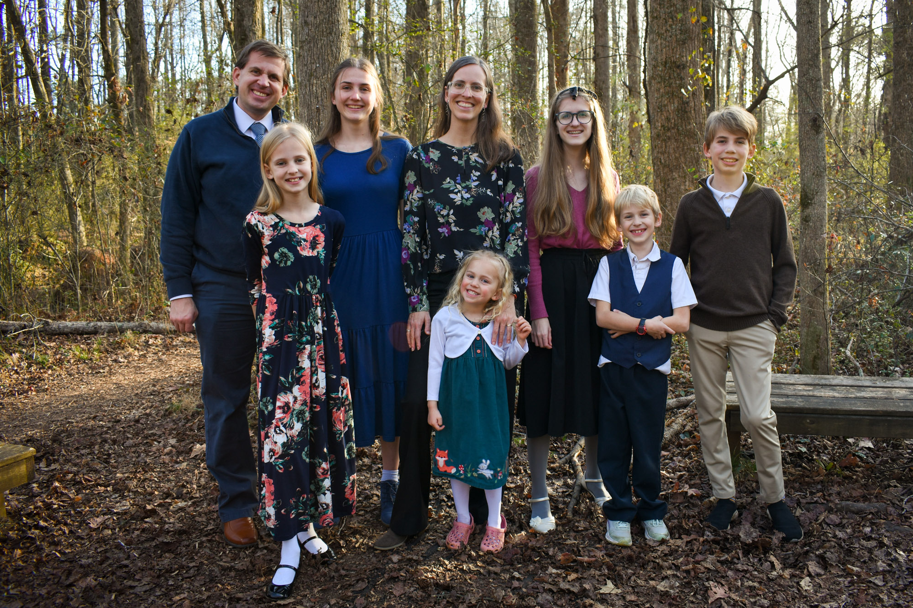

```{css, echo=FALSE}
#title-block-header .description {
    display: none;
}
```

```{r}
#| label: setup
#| include: false

knitr::opts_chunk$set(
  fig.retina = 3,
  dev = "ragg_png",
  fig.align = "center",
  cache.extra = 1234  # Change number to invalidate cache
)
```

Hello! We're excited to come to Doha! Here's a quick intro about us and our family:

- **Andrew**: I'll be at Georgetown University in Qatar in Education City as a professor of international politics and policy. [I study](/research/index.qmd) international NGOs and global philanthropy and human rights, and I [teach](/teaching/index.qmd) stats. I majored in Middle East Studies/Arabic at BYU, and we lived in Jordan for a summer (in 2006) for language study abroad, and after I graduated from BYU, we moved to Egypt so I could do a masters at the American University in Cairo (from 2008–2010). After that we ended up back at BYU where I did a masters of public administration, and *then* moved to Durham where I got a PhD at Duke. After *that*, I was a visiting professor at BYU for a couple years, and we've spent the past 7 years in Atlanta, where I've been at Georgia State University.
- **Nancy**: Nancy is a PhD student at the University of Georgia studying children's literacy and literature, and she'll be finishing her degree remotely from Doha. She writes regularly [at our family blog](https://www.heissatopia.com/).
- **Rachel** (18) just finished her freshman year at BYU and is majoring in Middle East Studies/Arabic. She's leaving on a mission to Hanoi, Vietnam in September, so she won't be in Doha with us.
- **Miriam** (16) will be a senior next school year. She has played the organ since she was 8 and will be applying to organ performance programs for college (see [this](https://www.youtube.com/watch?v=XscERbgbOis) and [this](https://www.youtube.com/watch?v=TJDjUGPrHyc) and [this](https://www.youtube.com/watch?v=XscERbgbOis) for some of what she does).
- **Benjamin** (14) will be in 9th grade
- **Zoë** (11) will be in 7th grade
- **Alexander** (8) will be in 3rd grade
- **Phoebe** (4) will be in pre-K



```{r}
#| label: map
#| message: false
#| warning: false
#| echo: false
#| column: page-inset
#| fig-width: 10
#| fig-height: 3.3
#| out-width: 100%
#| fig-alt: |
#|   Map in Equal Earth projection showing six places the author has lived
#|   between 1984 and the present: Provo (Utah), Rome (Italy), Amman
#|   (Jordan), Cairo (Egypt), Durham (North Carolina), Atlanta (Georgia), and 
#|   Doha (Qatar). Red curved arrows trace great circle routes between locations 
#|   in chronological order; each city is labeled with its name and the years
#|   lived there. Light blue ocean and peach landmasses provide the backdrop.

library(tidyverse)
library(sf)
library(rnaturalearth)
library(ggtext)

clr_ocean <- "#d9f0ff"
clr_land <- "#facba6"

world <- ne_countries(scale = 10) |>
  filter(admin != "Antarctica")

places <- tribble(
  ~city                    , ~lat       , ~long        , ~nudge_x , ~nudge_y , ~period                                                     ,
  "Provo, Utah"            , 40.248674  , -111.649261  , -1200000 ,        0 , "2005–2008;<br>2010–2012;<br>2017–2019" ,
  "Amman, Jordan"          , 32.015175  ,   35.873671  ,  1400000 ,   250000 , "2006"                                                      ,
  "Provo, Utah"            , 40.248674  , -111.649261  , NA       , NA       , NA                                                          ,
  "Cairo, Egypt"           , 29.9545395 ,   31.2657007 ,        0 ,  -700000 , "2008–2010"                                                 ,
  "Provo, Utah"            , 40.248674  , -111.649261  , NA       , NA       , NA                                                          ,
  "Durham, North Carolina" , 35.999115  ,  -78.943701  ,  2000000 ,   250000 , "2012–2017"                                      ,
  "Provo, Utah"            , 40.248674  , -111.649261  , NA       , NA       , NA                                                          ,
  "Atlanta, Georgia"       , 33.748955  ,  -84.388099  ,        0 ,  -700000 , "2019–2026"                                                 ,
  "Doha, Qatar"            , 25.318172  ,   51.443256  ,   300000 ,  -700000 , "2026+"
) |>
  mutate(order = 1:n()) |>
  mutate(
    label = glue::glue(
      "**{city}**<br><span style='font-size: 9pt; color: #666666;'>{period}</span>"
    )
  ) |>
  st_as_sf(coords = c("long", "lat"), crs = st_crs("EPSG:4326"))

# Plot great circle routes!
# Adapted from Jesse Sadler:
# https://www.jessesadler.com/post/great-circles-sp-sf/#great-circles-with-sf
#
# Extract just the coordinates for each point
coords <- st_coordinates(places) |>
  as_tibble() |>
  rename(long = X, lat = Y)

# Make a dataframe of all the paried cities
# (i.e. City A → City B, City B → City C, etc.)
pairs <- places |>
  arrange(order) |>
  st_drop_geometry() |>
  mutate(
    long = coords$long,
    lat = coords$lat,
    next_long = lead(long),
    next_lat = lead(lat),
    next_city = lead(city),
    next_order = lead(order)
  ) |>
  filter(!is.na(next_long))

# Create a linestring between each pair of points
pairs_paths <- pairs |>
  mutate(
    direction = ifelse(city == "Provo, Utah", "out", "in"), # Maybe use this?
    geometry = pmap(
      list(long, lat, next_long, next_lat),
      \(long, lat, next_long, next_lat) {
        line <- matrix(c(long, next_long, lat, next_lat), ncol = 2) |>
          st_linestring() |>
          st_sfc(crs = st_crs("EPSG:4326")) |>
          st_segmentize(units::set_units(50, km))

        # Trim the line a little at both ends to create a buffer
        line <- st_cast(line, "POINT")
        # Make sure there are enough points to trim
        if (length(line) > 10) {
          # Remove 5 segments from the start and end
          # Each segment is 50 km, so this makes a buffer of ≈250 km
          line <- line[6:(length(line) - 5)] |>
            st_combine() |>
            st_cast("LINESTRING")
        }

        line
      }
    )
  ) |>
  mutate(geometry = list_c(geometry)) |>
  st_sf()

# Make a little bounding box with these specific coordinates to to zoom in
bbox <- st_bbox(
  c(xmin = -125, xmax = 57, ymin = 17, ymax = 70),
  crs = st_crs("EPSG:4326")
) |>
  st_as_sfc() |>
  st_transform("+proj=eqearth") |>
  st_bbox()

# Plot this puppy
ggplot() +
  geom_sf(data = world, fill = clr_land, linewidth = 0) +
  geom_sf(
    data = pairs_paths,
    # I tried coloring by direction but didn't like it
    # aes(color = direction),
    color = "#d43511",
    linewidth = 0.8,
    arrow = arrow(length = unit(0.2, "cm"))
  ) +
  geom_sf(data = places) +
  geom_richtext(
    data = drop_na(places, period),
    aes(label = label, geometry = geometry),
    stat = "sf_coordinates",
    nudge_x = drop_na(places, period) |> pull(nudge_x),
    nudge_y = drop_na(places, period) |> pull(nudge_y),
    family = "Inter"
  ) +
  coord_sf(
    crs = "+proj=eqearth",
    xlim = c(bbox["xmin"], bbox["xmax"]),
    ylim = c(bbox["ymin"], bbox["ymax"])
  ) +
  theme_void(base_family = "Inter") +
  theme(
    panel.background = element_rect(fill = clr_ocean),
    plot.title = element_text(face = "bold", hjust = 0.5, size = rel(1.5)),
    plot.subtitle = element_text(
      hjust = 0.5,
      size = rel(1.1),
      margin = margin(t = 5, b = 5)
    )
  )
```
