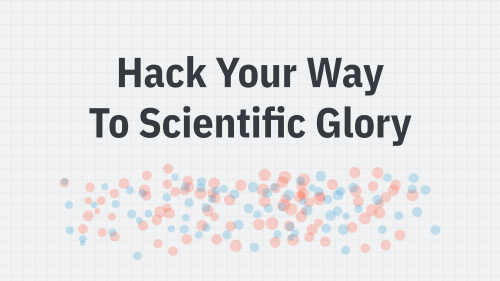
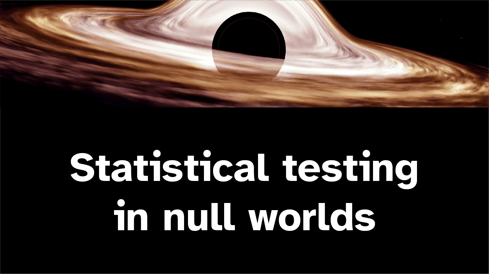

## Interactive resources

With the power of OJS and Quarto, I've created a few interactive websites to illustrate trickier statistical concepts when teaching. Check them out (and adapt and copy as much as you want!):

:::::: {.grid}

::::: {.card .g-col-12 .g-col-sm-4}

[{.card-img-top}](https://stats.andrewheiss.com/hack-your-way/)

:::: {.card-body}
Play with different variables until you get the p-value you want! 

[ Site](https://stats.andrewheiss.com/hack-your-way/){.card-link} [ Source](https://github.com/andrewheiss/hack-your-way){.card-link}

::: {.card-description}
Recreation of FiveThirtyEight's now-disappeared original "Hack Your Way To Scientific Glory"
:::
::::

:::::

::::: {.card .g-col-12 .g-col-sm-4}

[{.card-img-top}](https://nullworlds.andrewheiss.com/)

:::: {.card-body}
Learn the intuition behind p-values through simulation

[ Site](https://nullworlds.andrewheiss.com/){.card-link} [ Source](https://github.com/andrewheiss/null-world-testing){.card-link}

::: {.card-description}
Based on [{infer}](https://infer.netlify.app/) and Allen Downey's philosophy that [there is only one statistical test](https://allendowney.blogspot.com/2016/06/there-is-still-only-one-test.html)
:::

::::

:::::

::::: {.card .g-col-12 .g-col-sm-4}

[{.card-img-top}](https://dags.andrewheiss.com/)

:::: {.card-body}
A practical field guide to causal graphs, *do*‑calculus, and identification

[ Site](https://dags.andrewheiss.com/){.card-link} [ Source](https://github.com/andrewheiss/interactive-dags){.card-link}
::::

:::::

::::::

## Courses

### 2025–26

:::{#ay_25-26}
:::

### 2024–25

:::{#ay_24-25}
:::

### 2023–24

:::{#ay_23-24}
:::

### 2022–23

:::{#ay_22-23}
:::

### 2021–22

:::{#ay_21-22}
:::

### 2020–21

:::{#ay_20-21}
:::

### 2019–20

:::{#ay_19-20}
:::

### 2017–19

:::{#ay_17-19}
:::

### 2007–15

:::{#ay_older}
:::
